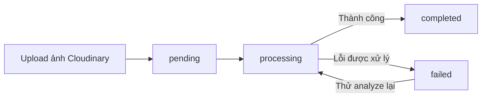

# Workflow hiện tại — ChillShrimp

Cập nhật ngày **09/10/2026**. Nội dung đối chiếu các route và chức năng hiện có trong mã nguồn. “Đã hiện thực” nghĩa là có triển khai trong code; không đồng nghĩa luồng đã được kiểm thử E2E thành công.

Các mã `WF01`–`WF33` dưới đây dùng để tham chiếu workflow trong tài liệu này, không thay thế mã use case `UCxx`.

## Quy tắc chung

- Danh tính nằm trong `users`; vai trò và trạng thái truy cập nằm trong `farm_members` theo từng trang trại.
- Backend xác thực Neon Auth và phiên ứng dụng `access_sessions`, sau đó kiểm tra membership, role và phạm vi khu vực trước khi xử lý nghiệp vụ.
- Owner có quyền toàn trại mà mình có membership Owner đang active. Area Manager và Technician thao tác trong khu vực được phân công; Warehouse Staff thực hiện nghiệp vụ kho theo quyền.
- Frontend gọi Express; Express kiểm tra quyền trước khi truy cập database hoặc gọi dịch vụ ngoài. Bí mật xác thực, database và API key không đặt trong frontend.
- Một số workflow có chức năng đã hiện thực một phần; các giới hạn được ghi ở mục cuối.

## Tài khoản và thành viên

| Mã | Workflow | Luồng xử lý chính | Vai trò |
| --- | --- | --- | --- |
| WF01 | Đăng nhập và chọn trại | Nhập email/mật khẩu → Neon xác thực → kiểm tra tài khoản ứng dụng → tạo phiên → tải membership active → chọn trại → áp dụng quyền theo trại/khu vực. | Tất cả vai trò |
| WF02 | Đăng xuất hoặc hết hạn phiên | Đăng xuất hoặc phiên hết hạn → hủy phiên ứng dụng/clear cookie; đăng xuất gọi Neon signOut → frontend về trang đăng nhập. | Tất cả vai trò |
| WF03 | Khôi phục mật khẩu | Nhập email → yêu cầu Neon gửi OTP → nhập mã trong cửa sổ hiệu lực 60 giây → đặt mật khẩu mới → đăng nhập lại. | Tất cả vai trò |
| WF04 | Cập nhật hồ sơ | Xem hồ sơ → sửa họ tên/điện thoại → lưu → cập nhật tên trên navbar. Email và role chỉ đọc. | Tất cả vai trò |
| WF05 | Đổi mật khẩu đang đăng nhập | Nhập mật khẩu hiện tại → nhập và xác nhận mật khẩu mới → Neon đổi mật khẩu và thu hồi các phiên Neon khác. | Tất cả vai trò |
| WF06 | Mời và tiếp nhận thành viên | Chọn trại → nhập email, role, khu vực → kiểm tra dữ liệu và quyền → tạo lời mời pending, token hash, hạn 24 giờ → SMTP gửi link → người nhận đặt mật khẩu → tạo danh tính Neon, user và membership → lời mời accepted. | Owner; Area Manager chỉ mời Technician cùng khu vực |
| WF07 | Thu hồi lời mời | Bật xem lời mời pending → chọn lời mời → xác nhận thu hồi → chuyển cancelled → link không còn dùng được. | Owner/Area Manager theo phạm vi quyền |
| WF08 | Quản lý thành viên | Xem danh sách → sửa thông tin, role hoặc khu vực theo quyền → suspend/kích hoạt lại → quyền truy cập thay đổi theo membership. Không tự đổi role hoặc suspend chính mình. | Owner; Area Manager quản lý Technician cùng khu vực |

OTP khôi phục mật khẩu do **Neon Auth** gửi; email lời mời do dịch vụ **SMTP** của backend gửi. HTTP 200/201 không chứng minh email đã đến hộp thư. Khi không cấu hình SMTP, dịch vụ lời mời hiện ghi link ra log để phát triển.

## Trang trại, khu vực và ao/bể

| Mã | Workflow | Luồng xử lý chính | Vai trò |
| --- | --- | --- | --- |
| WF09 | Thiết lập trang trại | Tạo trại → tự tạo membership Owner → cập nhật thông tin → tạo khu vực → tạo ao/bể. Các bước tạo là thao tác riêng, không phải một transaction chung. | Owner thiết lập trại/khu vực; Area Manager có thể tạo bể trong khu vực của mình |
| WF10 | Vòng đời trại/khu vực | Kiểm tra phụ thuộc → archive trại hoặc ngưng khu vực → khôi phục khi cần. Khu vực inactive không còn liên kết có thể xóa; thao tác xóa trại hiện là archive. | Owner |
| WF11 | Quản lý ao/bể | Tạo → cập nhật thông tin → đổi trạng thái → soft-delete khi empty/inactive → khôi phục nếu khu vực còn active. | Owner/Area Manager quản lý; Technician xem |

Trạng thái ao/bể hiện có: `empty`, `active`, `cleaning`, `inactive`. Backend kiểm tra chuyển trạng thái theo ma trận trong `pond-tank.controller.js`.

## Lô giống và kiểm định

| Mã | Workflow | Luồng xử lý chính | Vai trò |
| --- | --- | --- | --- |
| WF12 | Nhà cung cấp giống | Tạo/cập nhật nhà cung cấp → tìm kiếm → xem chi tiết và các lô liên quan trong phạm vi quyền. | Owner quản lý; Area Manager xem |
| WF13 | Tiếp nhận lô giống | Chọn bể empty thuộc khu vực active → nhập nguồn, số lượng và ngày → tạo lô active → ghi stocking event → chuyển bể active trong transaction. Có thể đính kèm giấy kiểm dịch đã xác minh trên Cloudinary. | Owner/Area Manager |
| WF14 | Cập nhật lô giống | Xem lô → kiểm tra phạm vi và trạng thái → sửa thông tin nguồn/kỹ thuật được phép → lưu. PATCH thông tin không dùng để chuyển bể. | Owner/Area Manager; Technician chỉ sửa trường kỹ thuật |
| WF15 | Biến động số lượng | Ghi mortality hoặc adjustment → kiểm tra số lượng → cập nhật số lượng ước tính → lưu lịch sử. Mortality/adjustment làm số lượng về 0 thì lô failed và bể empty. | Technician ghi mortality; Owner/Area Manager được adjustment |
| WF16 | Chuyển lô sang bể khác | Chọn bể đích empty → kiểm tra quyền và chuyển toàn bộ số lượng hiện tại → ghi transfer out/in → cập nhật bể của lô → nguồn empty, đích active. | Owner/Area Manager |
| WF17 | Lấy mẫu tăng trưởng | Nhập cỡ mẫu, khối lượng, chiều dài và số lượng ước tính → tính chỉ số còn thiếu khi đủ dữ liệu → lưu mẫu → xem lịch sử. | Owner/Area Manager/Technician |
| WF18 | Kiểm định chất lượng | Technician ghi kiểm định và bằng chứng → Owner/Area Manager duyệt confirmed hoặc action_required → nếu action_required thì xử lý và chuyển resolved. | Technician ghi; Owner/Area Manager duyệt |
| WF19 | Cập nhật trạng thái lô | active → ready_for_sale → sold; hoặc active → failed/cancelled. Backend chặn chuyển trạng thái không được phép. | Owner/Area Manager |

`WF19` chỉ cập nhật trạng thái lô. Chuyển sang `sold` chưa tạo giao dịch bán, khách hàng hoặc doanh thu. Hiện chức năng này chưa đồng bộ trạng thái ao/bể theo quy trình kết thúc; khác với nhánh số lượng về 0 ở `WF15`.

## Chăm sóc và môi trường

| Mã | Workflow | Luồng xử lý chính | Vai trò |
| --- | --- | --- | --- |
| WF20 | Ghi môi trường và sinh cảnh báo | Nhập ít nhất một thông số nước → chọn ngưỡng đã duyệt, active, còn hiệu lực và phù hợp loài/giai đoạn/loại bể → so sánh → lưu log và cảnh báo warning/critical trong transaction. | Owner/Area Manager/Technician |
| WF21 | Cấu hình ngưỡng | Tạo draft có nguồn tham chiếu → duyệt và kích hoạt → áp dụng cho log mới → sửa ngưỡng đã duyệt thành revision mới cần duyệt lại, hoặc vô hiệu ngưỡng. | Owner cấu hình; Owner/Area Manager/Technician xem |
| WF22 | Nhật ký cho ăn | Chọn bể active → lấy khuyến nghị nếu đủ dữ liệu → nhập lượng thực tế → lưu log → nếu liên kết thức ăn kho, kiểm tra đơn vị/tồn, trừ tồn và ghi usage ledger trong cùng transaction. | Owner/Area Manager/Technician |
| WF23 | Nhật ký thay nước | Chọn bể → nhập tỷ lệ, thời gian, ghi chú → lưu → lọc và xem lịch sử theo phạm vi quyền. | Owner/Area Manager/Technician |
| WF24 | Nhật ký thuốc/chế phẩm | Chọn bể → nhập sản phẩm, liều lượng, mục đích → lưu → nếu liên kết vật tư medicine/chemical/probiotic, kiểm tra tồn và đơn vị, trừ tồn và ghi usage ledger. | Owner/Area Manager/Technician |

Cảnh báo môi trường hiện được sinh **đồng bộ khi ghi log**, chưa phải tiến trình cron/job. Các nhật ký hiện có luồng tạo/xem; không giả định đã có API sửa/xóa.

## Phân tích AI

| Mã | Workflow | Luồng xử lý chính | Vai trò |
| --- | --- | --- | --- |
| WF25 | Phân tích ảnh | Chọn lô → backend cấp chữ ký upload → frontend tải ảnh lên Cloudinary → backend xác minh asset và tạo inspection pending → gọi analyze → processing → tải ảnh và gọi YOLO → lưu count, confidence, mật độ nếu có thể tích mẫu, model version và ảnh đánh dấu → completed. Lỗi xử lý chuyển failed. | Owner/Area Manager/Technician |
| WF26 | Lịch sử/kết quả AI | Chọn lô → tải danh sách inspection → mở ảnh và số liệu → với failed có thể thử analyze lại; completed trả kết quả đã lưu. | Owner/Area Manager/Technician |

Backend kiểm tra phiên, membership và phạm vi lô trước khi gọi AI Service. Frontend không gọi AI Service trực tiếp. Trường hợp backend dừng giữa lúc processing hiện chưa có cơ chế tự thu hồi tác vụ.

## Kho vật tư

| Mã | Workflow | Luồng xử lý chính | Vai trò |
| --- | --- | --- | --- |
| WF27 | Danh mục và nhập kho | Tạo vật tư với tồn ban đầu 0 → nhập số lượng/đơn giá → tăng tồn và cập nhật đơn giá → ghi import ledger. Không sửa quantity trực tiếp trong danh mục. | Owner/Warehouse Staff quản lý; Area Manager/Technician xem danh mục |
| WF28 | Yêu cầu cấp vật tư | Chọn vật tư/khu vực → nhập số lượng → tạo request pending → xem danh sách theo phạm vi. Tạo request không làm giảm tồn. | Owner/Area Manager tạo; Owner/Area Manager/Warehouse Staff xem |
| WF29 | Ghi sử dụng vật tư | Chọn vật tư và lô nếu cần → kiểm tra quyền, trạng thái lô và tồn → trừ kho → ghi usage ledger. Technician bắt buộc liên kết lô active/ready_for_sale trong khu vực. | Owner/Technician |
| WF30 | Điều chỉnh tồn | Nhập hướng tăng/giảm, số lượng, thời gian, lý do → kiểm tra giới hạn tồn → cập nhật tồn → ghi adjustment ledger có dấu. | Owner/Warehouse Staff |
| WF31 | Theo dõi tồn thấp | So sánh quantity < minThreshold → hiển thị isBelowThreshold → lọc vật tư dưới ngưỡng → cập nhật kết quả sau giao dịch. | Các role có quyền xem danh mục |

`WF28` hiện kết thúc ở tạo/xem request pending, chưa nối sang duyệt, xuất/cấp hoặc hoàn tất yêu cầu. Usage ở `WF29` và usage từ nhật ký chăm sóc không đồng nghĩa request đã được fulfilled. `WF31` là chỉ báo/bộ lọc danh mục, chưa có notification hay lịch sử cảnh báo kho độc lập.

## Dashboard, báo cáo và cảnh báo

| Mã | Workflow | Luồng xử lý chính | Vai trò |
| --- | --- | --- | --- |
| WF32 | Dashboard và báo cáo cho ăn | Chọn trại → xem thông tin farm/role/area → chọn khoảng ngày/bể → tổng hợp lượng thực tế, khuyến nghị và chênh lệch theo đơn vị, bể, ngày → xem nhật ký gần đây. | Owner/Area Manager/Technician xem report; Warehouse Staff xem dashboard |
| WF33 | Xem và đánh dấu cảnh báo | Xem cảnh báo môi trường theo phạm vi → lọc severity/trạng thái đã đọc → xem chi tiết measurement và ngưỡng → đánh dấu đã đọc. | Owner toàn trại; Area Manager/Technician theo khu vực |

Đánh dấu đã đọc không đồng nghĩa đã khắc phục nguyên nhân cảnh báo. Dashboard hiện chưa tổng hợp tài chính, doanh thu hoặc toàn bộ công việc vận hành.

## Workflow còn thiếu hoặc chưa hoàn chỉnh

| Phần còn lại | Liên quan | Trạng thái hiện tại |
| --- | --- | --- |
| Mời user đã tồn tại tham gia trại khác | WF06 / UC03.1 | API hiện từ chối email đã có tài khoản; multi-farm onboarding chưa hoàn tất. |
| Đồng bộ bể khi kết thúc lô | WF19 / UC05.2 | Chức năng đổi trạng thái chỉ ghi batch; cần chốt và hiện thực quy trình bể empty/cleaning. |
| Hiệu chỉnh số đếm thủ công | WF25–26 / UC06 | Chưa có API cập nhật manualCount dù UI hiển thị trường kết quả. |
| Phục hồi tác vụ processing sau restart | WF25 / UC06.1 | Chưa có lease/deadline và cơ chế thu hồi tác vụ. |
| Duyệt, xuất/cấp và hoàn tất request kho | WF28 / UC07.4 | Mới tạo/xem yêu cầu; chưa workflow xử lý yêu cầu. |
| Chi phí, xuất bán và doanh thu | UC08.1–UC08.3, UC08.5–UC08.6 | Chưa có workflow nghiệp vụ đầy đủ; status sold chưa phải giao dịch bán. |
| Khách hàng | UC08.4 | Đã thêm tạo/xem/sửa/xóa mềm, tìm tên/điện thoại và lọc loại cho Owner theo trại. Cần áp dụng migration customers; lịch sử mua chờ UC08.5. Xem [CUSTOMER-MANAGEMENT.md](./CUSTOMER-MANAGEMENT.md). |
| Notification/lịch sử cảnh báo kho và cảnh báo AI tự động | WF31 / UC09 | Kho hiện là flag/filter; không giả định đã có notification hoặc alert AI. |

## Workflow tích hợp để kiểm thử/demo

**Tạo trại/khu vực → mời nhân viên → tạo bể → nhập kho → tiếp nhận lô → ghi chăm sóc/tăng trưởng → kiểm định/AI → xem cảnh báo và báo cáo → kết thúc lô.**

Chạy trên staging với tài khoản test bốn vai trò, dữ liệu hai trại/hai khu vực và hộp thư test. Sau mỗi bước ghi dữ liệu, kiểm tra lại bản ghi, tồn kho và ledger liên quan; đối chiếu quyền Owner và nhân viên theo khu vực. Không trình bày bước kết thúc lô như quy trình bán giống hoàn chỉnh.

Bộ test case tham chiếu: [IMPLEMENTED-USECASE-TESTCASES.md](../07-testing/IMPLEMENTED-USECASE-TESTCASES.md). Các case mới đang ở trạng thái Not run; cần ghi kết quả thực tế khi thực thi.

## Workflow thay đổi database

Tạo migration Prisma trên nhánh phát triển → review SQL trong `BE/prisma/migrations` → commit cùng code → deploy bằng `npm run migrate:deploy` → kiểm tra trạng thái và hoạt động ứng dụng.

Không sửa migration đã áp dụng. Thay đổi cấu trúc database cần được quản lý phiên bản; tránh sửa Neon thủ công làm lệch lịch sử migration.

## Nguồn đối chiếu

- [USECASE.md](../04-use-cases/USECASE.md) và [USECASE-SPECIFICATION.md](../04-use-cases/USECASE-SPECIFICATION.md).
- [app.js](../../BE/src/app.js), các route trong `BE/src/routes`, `BE/src/users` và `BE/src/auth`.
- Các controller nghiệp vụ và [environment-threshold.service.js](../../BE/src/services/environment-threshold.service.js).
- [ARCHITECTURE.md](../02-architecture/ARCHITECTURE.md); tài liệu có thể còn mô tả kiến trúc đích, nên phạm vi workflow ở trên ưu tiên mã hiện tại.
