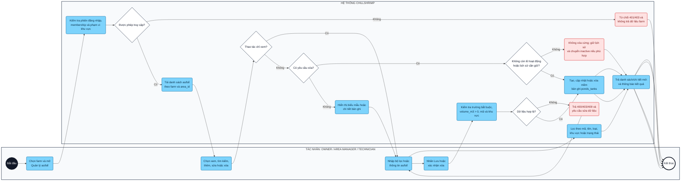

# Sơ đồ Activity cho 5 use case cấp 2 trọng tâm — ChillShrimp

> Nguồn đặc tả: [USECASE-SPECIFICATION.md](./USECASE-SPECIFICATION.md#7-đặc-tả-chi-tiết-5-use-case-trọng-tâm). Năm sơ đồ dưới đây bám theo đúng phạm vi của các use case cấp 2 được chọn, không gộp lại với use case cấp 1.

> **Bản dùng cho draw.io:** các khối Mermaid sử dụng cú pháp `graph` và `subgraph` tiêu chuẩn, không dùng cú pháp swimlane mở rộng. Mỗi khối là một sơ đồ độc lập; khi nhập vào draw.io/VPasCode, chỉ sao chép phần mã bên trong từng khối Mermaid.

## Quy ước trình bày

- Mỗi sơ đồ có hai lane: **Tác nhân** và **Hệ thống**.
- Bố cục mô phỏng mẫu báo cáo: lane tác nhân ở bên trái, lane hệ thống ở bên phải; luồng chính đi từ trên xuống dưới.
- Hình tròn là điểm bắt đầu/kết thúc; hình chữ nhật bo góc là hoạt động; hình thoi là điều kiện rẽ nhánh.
- Nhánh đỏ thể hiện lỗi hoặc yêu cầu bị từ chối.
- Các bước kiểm tra quyền đều dựa trên farm_members, status, role và area_id của farm đang chọn.
- UC04.2, UC05.1, UC06.1, UC08.5 và UC09.1 là năm use case độc lập ở mức đặc tả chi tiết; các nghiệp vụ liên quan nhưng khác mã được giữ ngoài sơ đồ.

---

## 1. UC04.2 — CRUD ao hoặc bể

Phạm vi: tạo, xem/tìm kiếm, cập nhật và xóa mềm ao/bể trong đúng farm. Cập nhật thông tin farm và chuyển trạng thái ao/bể thuộc các use case khác.

*Hình 1. Sơ đồ activity — UC04.2 — CRUD ao hoặc bể*

### Diễn giải luồng

1. Người dùng chọn farm; hệ thống xác minh phiên, membership đang active, role và area_id.
2. Hệ thống tải danh sách ao/bể trong đúng phạm vi. Người dùng có thể xem/tìm kiếm mà không cần quyền ghi.
3. Khi thêm hoặc sửa, hệ thống hiển thị form và kiểm tra mã không trùng, thể tích dương, khu vực cùng farm.
4. Khi xóa, hệ thống kiểm tra ao/bể còn lô hoạt động hoặc lịch sử cần bảo toàn hay không. Nếu có, chỉ cho xóa mềm/chuyển inactive.
5. Hệ thống lưu bản ghi ponds_tanks và trả kết quả mới; mọi lỗi đều kết thúc bằng thông báo phù hợp, không ghi dữ liệu dở dang.

---

## 2. UC05.1 — CRUD lô giống

Phạm vi: tiếp nhận, tạo, xem và cập nhật hồ sơ lô giống; bao gồm số lượng ban đầu và thông tin chất lượng đầu vào. Cập nhật trạng thái lô và nhật ký chăm sóc thuộc các use case khác.

```mermaid
graph LR
    subgraph ACTOR["TÁC NHÂN: OWNER / AREA MANAGER / TECHNICIAN"]
        direction TB
        B0((Bắt đầu)):::start
        B1("Chọn farm và ao/bể<br/>tiếp nhận lô"):::actor
        B2("Chọn tạo mới, xem, cập nhật<br/>hoặc yêu cầu xóa lô"):::actor
        B3("Nhập thông tin lô,<br/>chất lượng và số lượng"):::actor
        B4("Xác nhận lưu thay đổi"):::actor
        B5((Kết thúc)):::finish
    end

    subgraph SYSTEM["HỆ THỐNG CHILLSHRIMP"]
        direction TB
        T1("Kiểm tra membership,<br/>role và phạm vi area_id"):::system
        D1{"Được phép thao tác?"}:::decision
        E1("Từ chối 401/403"):::error
        T2("Kiểm tra ao/bể cùng farm,<br/>trạng thái và lô đang chiếm dụng"):::system
        D2{"Ao/bể và farm hợp lệ?"}:::decision
        E2("Từ chối 403/404 vì ao/bể<br/>không thuộc farm hoặc không tồn tại"):::error
        T3("Hiển thị danh sách hoặc<br/>biểu mẫu lô giống"):::system
        D3{"Chỉ xem chi tiết?"}:::decision
        T4("Trả hồ sơ, chất lượng,<br/>số lượng và lịch sử mẫu"):::system
        T5("Kiểm tra mã lô duy nhất,<br/>số lượng dương và quan hệ cùng farm"):::system
        D4{"Dữ liệu hợp lệ?"}:::decision
        E3("Trả 400/403/409 và<br/>yêu cầu nhập lại"):::error
        D5{"Tạo lô mới?"}:::decision
        D6{"Ao/bể empty và<br/>chưa có lô active?"}:::decision
        E4("Từ chối 409 vì ao/bể<br/>đang được sử dụng"):::error
        T6("Transaction: khóa ao/bể, tạo seed_batches<br/>và ghi batch_quantity_events ban đầu"):::system
        D8{"Có hồ sơ kiểm dịch<br/>hoặc chất lượng?"}:::decision
        T10("Lưu seed_quality_checks<br/>và tệp bằng chứng nếu có"):::system
        T7("Cập nhật trường được phép,<br/>không ghi đè lịch sử"):::system
        T9("Chuyển sang UC05.2 hoặc lưu<br/>dấu vết hủy; không xóa cứng"):::system
        T8("Trả hồ sơ lô và số lượng<br/>hiện tại sau khi lưu"):::system
        D7{"Yêu cầu xóa lô?"}:::decision
    end

    B0 --> B1 --> T1 --> D1
    D1 -- "Không" --> E1 --> B5
    D1 -- "Có" --> T2 --> D2
    D2 -- "Không" --> E2 --> B5
    D2 -- "Có" --> T3 --> B2 --> D3
    D3 -- "Có" --> T4 --> B5
    D3 -- "Không" --> D7
    D7 -- "Có" --> T9 --> T8 --> B5
    D7 -- "Không" --> B3 --> B4 --> T5 --> D4
    D4 -- "Không" --> E3 --> B3
    D4 -- "Có" --> D5
    D5 -- "Có" --> D6
    D6 -- "Không" --> E4 --> B2
    D6 -- "Có" --> T6 --> D8
    D8 -- "Có" --> T10 --> T8 --> B5
    D8 -- "Không" --> T8
    D5 -- "Không" --> T7 --> T8 --> B5

    classDef actor fill:#7dd3fc,stroke:#0369a1,color:#082f49,stroke-width:1.5px;
    classDef system fill:#7dd3fc,stroke:#0369a1,color:#082f49,stroke-width:1.5px;
    classDef decision fill:#ffffff,stroke:#334155,color:#0f172a,stroke-width:1.8px;
    classDef error fill:#fee2e2,stroke:#dc2626,color:#7f1d1d,stroke-width:1.5px;
    classDef start fill:#111827,stroke:#111827,color:#ffffff,stroke-width:2px;
    classDef finish fill:#ffffff,stroke:#111827,color:#111827,stroke-width:4px;
    style ACTOR fill:#f8fafc,stroke:#334155,stroke-width:2px
    style SYSTEM fill:#f8fafc,stroke:#334155,stroke-width:2px
```

*Hình 2. Sơ đồ activity — UC05.1 — CRUD lô giống*

### Diễn giải luồng

1. Người dùng chọn farm và ao/bể; hệ thống kiểm tra membership, role, khu vực và tình trạng ao/bể.
2. Nếu chỉ xem, hệ thống trả danh sách/chi tiết theo phạm vi; nếu tạo hoặc cập nhật, hệ thống hiển thị form.
3. Hệ thống kiểm tra mã lô, loài, giai đoạn PL, nhà cung cấp, số lượng và các quan hệ cùng farm.
4. Khi tạo, seed_batches và sự kiện số lượng ban đầu được ghi trong cùng transaction; việc chuyển trạng thái ao/bể thuộc UC04.3.
5. Nếu đã có hồ sơ kiểm dịch/chất lượng đầu vào, hệ thống lưu thêm seed_quality_checks và tệp bằng chứng ngay khi tạo lô.
6. Khi cập nhật, chỉ các trường được phép thay đổi; lịch sử chất lượng, số lượng và mẫu tăng trưởng không bị ghi đè.
7. Khi yêu cầu xóa lô đã có lịch sử, hệ thống chuyển sang xử lý trạng thái phù hợp hoặc lưu dấu vết hủy, không xóa cứng dữ liệu.

---

## 3. UC06.1 — Thực hiện AI Inspection

Phạm vi: lấy ảnh mẫu, gửi ảnh tới AI Service, lưu kết quả đếm/confidence/mật độ và cho phép lưu hiệu chỉnh thủ công. Xem lịch sử các lần kiểm tra là UC06.2.

```mermaid
graph LR
    subgraph ACTOR["TÁC NHÂN: OWNER / AREA MANAGER / TECHNICIAN"]
        direction TB
        C0((Bắt đầu)):::start
        C1("Mở chi tiết lô và chọn<br/>Thực hiện AI Inspection"):::actor
        C2("Lấy mẫu, đặt vào khay/đĩa<br/>và chụp hoặc tải ảnh"):::actor
        C3("Nhập phương pháp lấy mẫu,<br/>thể tích và ghi chú"):::actor
        C4("Xác nhận gửi phân tích"):::actor
        C5("Xem kết quả và nhận cảnh báo<br/>confidence nếu thấp"):::actor
        C6("Nhập manual_count hoặc<br/>correction_factor nếu cần"):::actor
        C8("Chọn thử lại yêu cầu phân tích"):::actor
        C7((Kết thúc)):::finish
    end

    subgraph SYSTEM["HỆ THỐNG CHILLSHRIMP + AI SERVICE"]
        direction TB
        I1("Kiểm tra membership, khu vực<br/>và trạng thái lô"):::system
        D1{"Được phép và lô hợp lệ?"}:::decision
        E1("Từ chối 403 hoặc 404"):::error
        I2("Kiểm tra định dạng, kích thước,<br/>dung lượng ảnh"):::system
        D2{"Ảnh hợp lệ?"}:::decision
        E2("Trả 400; không gửi ảnh<br/>sang AI Service"):::error
        I3("Lưu ảnh gốc và tạo ai_inspections<br/>ở trạng thái pending"):::system
        I11("Nếu là mẫu tăng trưởng, lưu<br/>growth_sampling_logs theo batch_id"):::system
        I4("Chuyển processing và<br/>gửi ảnh đến AI Service"):::system
        I5("AI Service trả detections,<br/>bounding box, confidence và model"):::system
        D3{"AI trả kết quả hợp lệ?"}:::decision
        E3("Đặt status = failed, giữ lịch sử<br/>và cho phép thử lại"):::error
        D5{"Người dùng chọn thử lại?"}:::decision
        I6("Tính detected_count,<br/>average_confidence và mật độ"):::system
        D4{"Có sample_volume_ml > 0?"}:::decision
        I7("Tính density_per_ml =<br/>effective_count / sample_volume_ml"):::system
        I8("Lưu density_per_ml = NULL<br/>và thông báo chưa đủ thể tích"):::system
        I9("Lưu ảnh chú thích, model_version,<br/>kết quả và status = completed"):::system
        D6{"Confidence thấp hoặc<br/>cần chú ý?"}:::decision
        I12("Tạo alerts_notifications và<br/>yêu cầu kiểm tra thủ công"):::system
        I10("Lưu manual_count/correction_factor<br/>riêng, không ghi đè kết quả gốc"):::system
        D7{"Có cần hiệu chỉnh thủ công?"}:::decision
    end

    C0 --> C1 --> I1 --> D1
    D1 -- "Không" --> E1 --> C7
    D1 -- "Có" --> C2 --> I2 --> D2
    D2 -- "Không" --> E2 --> C7
    D2 -- "Có" --> I3 --> I11 --> C3 --> C4 --> I4 --> I5 --> D3
    D3 -- "Không hoặc timeout" --> E3 --> D5
    D5 -- "Không" --> C7
    D5 -- "Có" --> C8 --> I3 --> C3 --> C4 --> I4 --> I5 --> D3
    D3 -- "Có" --> I6 --> D4
    D4 -- "Có" --> I7 --> I9 --> D6
    D4 -- "Không" --> I8 --> I9 --> D6
    D6 -- "Có" --> I12 --> C5 --> D7
    D6 -- "Không" --> C5 --> D7
    D7 -- "Có" --> C6 --> I10 --> C7
    D7 -- "Không" --> C7

    classDef actor fill:#7dd3fc,stroke:#0369a1,color:#082f49,stroke-width:1.5px;
    classDef system fill:#7dd3fc,stroke:#0369a1,color:#082f49,stroke-width:1.5px;
    classDef decision fill:#ffffff,stroke:#334155,color:#0f172a,stroke-width:1.8px;
    classDef error fill:#fee2e2,stroke:#dc2626,color:#7f1d1d,stroke-width:1.5px;
    classDef start fill:#111827,stroke:#111827,color:#ffffff,stroke-width:2px;
    classDef finish fill:#ffffff,stroke:#111827,color:#111827,stroke-width:4px;
    style ACTOR fill:#f8fafc,stroke:#334155,stroke-width:2px
    style SYSTEM fill:#f8fafc,stroke:#334155,stroke-width:2px
```

*Hình 3. Sơ đồ activity — UC06.1 — Thực hiện AI Inspection*

### Diễn giải luồng

1. Người dùng chọn một lô thuộc phạm vi được cấp quyền, lấy mẫu và tải ảnh lên.
2. Hệ thống kiểm tra ảnh trước khi lưu; ảnh hợp lệ tạo bản ghi ai_inspections ở trạng thái pending.
3. Backend chuyển sang processing và gọi AI Service. Kết quả phải có detection, confidence hợp lệ và phiên bản model.
4. Hệ thống tính số lượng, confidence trung bình và mật độ nếu có thể tích mẫu; sau đó lưu ảnh chú thích cùng kết quả.
5. Nếu confidence thấp hoặc có dấu hiệu cần chú ý, hệ thống tạo cảnh báo hỗ trợ để người dùng kiểm tra thủ công.
6. Người dùng có thể hiệu chỉnh nếu cần; giá trị hiệu chỉnh được lưu riêng để bảo toàn kết quả AI gốc.
7. Lỗi ảnh, timeout hoặc response sai làm bản ghi failed; người dùng có thể yêu cầu tạo lần phân tích mới và giữ lịch sử lỗi.

---

## 4. UC08.5 — Xuất bán con giống

Phạm vi: Owner tạo giao dịch bán con giống, cập nhật số lượng lô và trạng thái lô khi bán hết. Quản lý chi phí, khách hàng và xem doanh thu là các use case khác.

```mermaid
graph LR
    subgraph ACTOR["TÁC NHÂN: OWNER"]
        direction TB
        D0((Bắt đầu)):::start
        D1("Owner mở chức năng<br/>Xuất bán con giống"):::actor
        D2("Chọn khách hàng và<br/>lô đủ điều kiện"):::actor
        D3("Nhập số lượng, giá cơ sở,<br/>phụ phí, vận chuyển và chiết khấu"):::actor
        D4("Xem lại và xác nhận<br/>giao dịch"):::actor
        D5("Mở lịch sử bán hoặc<br/>chi tiết giao dịch"):::actor
        D6((Kết thúc)):::finish
    end

    subgraph SYSTEM["HỆ THỐNG CHILLSHRIMP"]
        direction TB
        V1("Kiểm tra membership và<br/>role OWNER tại farm"):::system
        X1{"Có quyền Owner?"}:::decision
        E1("Từ chối 403"):::error
        V2("Tải khách hàng, bảng giá và<br/>lô ready_for_sale cùng farm"):::system
        V3("Hiển thị số lượng hiện tại,<br/>price_list_id, giá đề xuất và chất lượng"):::system
        X0{"Có bảng giá phù hợp?"}:::decision
        V3A("Cho nhập giá thủ công và lưu<br/>nguồn giá là nhập tay"):::system
        V4("Tính price_per_thousand từ giá cơ sở<br/>và phụ phí; tính gross_revenue,<br/>total_revenue"):::system
        V5("Kiểm tra farm, price_list_id,<br/>giá snapshot, số lượng và chiết khấu"):::system
        X2{"Dữ liệu hợp lệ và<br/>còn đủ số lượng?"}:::decision
        E2("Trả 400/403/409; không tạo<br/>giao dịch bán"):::error
        V6("Transaction + khóa lô:<br/>tạo seed_sales, ghi sự kiện sale<br/>và giảm số lượng"):::system
        X3{"Số lượng còn lại = 0?"}:::decision
        V7("Cập nhật lô thành sold"):::system
        V8("Giữ lô ready_for_sale<br/>khi chỉ bán một phần"):::system
        V9("Trả giao dịch, doanh thu,<br/>giá snapshot và số lượng còn lại"):::system
    end

    D0 --> D1 --> V1 --> X1
    X1 -- "Không" --> E1 --> D6
    X1 -- "Có" --> V2 --> D2 --> V3 --> X0
    X0 -- "Có" --> D3 --> V4 --> V5 --> X2
    X0 -- "Không" --> V3A --> D3
    X2 -- "Không" --> E2 --> D3
    X2 -- "Có" --> D4 --> V6 --> X3
    X3 -- "Có" --> V7 --> V9 --> D5 --> D6
    X3 -- "Không" --> V8 --> V9 --> D5 --> D6

    classDef actor fill:#7dd3fc,stroke:#0369a1,color:#082f49,stroke-width:1.5px;
    classDef system fill:#7dd3fc,stroke:#0369a1,color:#082f49,stroke-width:1.5px;
    classDef decision fill:#ffffff,stroke:#334155,color:#0f172a,stroke-width:1.8px;
    classDef error fill:#fee2e2,stroke:#dc2626,color:#7f1d1d,stroke-width:1.5px;
    classDef start fill:#111827,stroke:#111827,color:#ffffff,stroke-width:2px;
    classDef finish fill:#ffffff,stroke:#111827,color:#111827,stroke-width:4px;
    style ACTOR fill:#f8fafc,stroke:#334155,stroke-width:2px
    style SYSTEM fill:#f8fafc,stroke:#334155,stroke-width:2px
```

*Hình 4. Sơ đồ activity — UC08.5 — Xuất bán con giống*

### Diễn giải luồng

1. Chỉ OWNER có thể bắt đầu giao dịch; hệ thống tải khách hàng, bảng giá và lô ready_for_sale trong cùng farm.
2. Owner chọn bảng giá phù hợp hoặc nhập giá thủ công, sau đó nhập số lượng, giá cơ sở, phụ phí, phí vận chuyển và chiết khấu.
3. Hệ thống tính price_per_thousand, gross_revenue và total_revenue; đồng thời kiểm tra quan hệ cùng farm.
4. Backend khóa lô trong transaction để tránh hai giao dịch bán vượt số lượng.
5. Khi thành công, hệ thống tạo seed_sales, ghi batch_quantity_events loại sale và giảm số lượng lô.
6. Nếu số lượng về 0, lô chuyển sold; nếu còn, lô vẫn ready_for_sale. Hệ thống trả snapshot giá, doanh thu và số lượng còn lại.

---

## 5. UC09.1 — Xem Dashboard theo phạm vi quyền

Phạm vi: tổng hợp KPI và dữ liệu quan sát theo farm, thời gian, khu vực và role. Tạo/xem/xử lý cảnh báo chi tiết thuộc UC09.2–UC09.4.

```mermaid
graph LR
    subgraph ACTOR["TÁC NHÂN: OWNER / AREA MANAGER / TECHNICIAN / WAREHOUSE STAFF"]
        direction TB
        E0((Bắt đầu)):::start
        E1("Chọn farm và mở<br/>Dashboard"):::actor
        E2("Chọn khoảng thời gian,<br/>khu vực hoặc KPI"):::actor
        E3("Chọn KPI/biểu đồ để<br/>xem chi tiết"):::actor
        E4((Kết thúc)):::finish
    end

    subgraph SYSTEM["HỆ THỐNG CHILLSHRIMP"]
        direction TB
        G1("Kiểm tra phiên, membership,<br/>role và area_id"):::system
        D1{"Farm và phạm vi<br/>hợp lệ?"}:::decision
        F1("Từ chối 401/403 và<br/>xóa dữ liệu không còn quyền"):::error
        G2("Kiểm tra bộ lọc và khoảng<br/>thời gian"):::system
        D2{"Bộ lọc hợp lệ?"}:::decision
        F2("Trả 400 và yêu cầu<br/>chọn lại bộ lọc"):::error
        G3("Truy vấn dữ liệu theo scope:<br/>farm_id, area_id, thời gian và bộ lọc"):::system
        D3{"Role thuộc phạm vi nào?"}:::decision
        G4("Owner: tổng hợp toàn farm<br/>vận hành, kho, cảnh báo,<br/>chi phí và doanh thu"):::system
        G5("Area Manager/Technician:<br/>chỉ tổng hợp area_id được giao"):::system
        G6("Warehouse Staff: chỉ tổng hợp<br/>kho và cảnh báo tồn kho"):::system
        G7("Tính KPI, biểu đồ và thời điểm<br/>cập nhật gần nhất"):::system
        D4{"Có dữ liệu?"}:::decision
        G8("Hiển thị trạng thái rỗng,<br/>KPI bằng 0 hoặc chưa xác định"):::system
        G9("Hiển thị Dashboard theo quyền"):::system
        G10("Kiểm tra lại quyền và truy ngược<br/>bản ghi nguồn của KPI"):::system
        G11("Hiển thị danh sách chi tiết"):::system
    end

    E0 --> E1 --> G1 --> D1
    D1 -- "Không" --> F1 --> E4
    D1 -- "Có" --> E2 --> G2 --> D2
    D2 -- "Không" --> F2 --> E2
    D2 -- "Có" --> D3
    D3 -- "Owner" --> G4 --> G3 --> G7
    D3 -- "Area Manager/Technician" --> G5 --> G3 --> G7
    D3 -- "Warehouse Staff" --> G6 --> G3 --> G7
    G7 --> D4
    D4 -- "Không" --> G8 --> E2
    D4 -- "Có" --> G9 --> E3 --> G10 --> G11 --> E4

    classDef actor fill:#7dd3fc,stroke:#0369a1,color:#082f49,stroke-width:1.5px;
    classDef system fill:#7dd3fc,stroke:#0369a1,color:#082f49,stroke-width:1.5px;
    classDef decision fill:#ffffff,stroke:#334155,color:#0f172a,stroke-width:1.8px;
    classDef error fill:#fee2e2,stroke:#dc2626,color:#7f1d1d,stroke-width:1.5px;
    classDef start fill:#111827,stroke:#111827,color:#ffffff,stroke-width:2px;
    classDef finish fill:#ffffff,stroke:#111827,color:#111827,stroke-width:4px;
    style ACTOR fill:#f8fafc,stroke:#334155,stroke-width:2px
    style SYSTEM fill:#f8fafc,stroke:#334155,stroke-width:2px
```

*Hình 5. Sơ đồ activity — UC09.1 — Xem Dashboard theo phạm vi quyền*

### Diễn giải luồng

1. Người dùng chọn farm và mở Dashboard; hệ thống kiểm tra phiên, membership, role và area_id.
2. Người dùng chọn thời gian hoặc bộ lọc; hệ thống kiểm tra bộ lọc rồi truy vấn dữ liệu trong đúng tenant.
3. Owner xem toàn farm; Area Manager và Technician xem khu vực được giao; Warehouse Staff chỉ xem KPI kho và cảnh báo tồn kho.
4. Hệ thống tổng hợp số ao/bể, lô hoạt động, cảnh báo, tồn kho, chi phí và doanh thu phù hợp với role.
5. Nếu không có dữ liệu, hệ thống hiển thị trạng thái rỗng thay vì lấy dữ liệu farm khác. Khi người dùng chọn KPI, hệ thống kiểm tra quyền lần nữa trước khi trả chi tiết.

---

## Phạm vi không đưa vào 5 sơ đồ này

- UC04.1, UC04.3: thông tin farm và trạng thái ao/bể.
- UC05.2–UC05.6: trạng thái lô, môi trường nước, cho ăn, thay nước và thuốc/chế phẩm.
- UC06.2: xem lịch sử AI Inspection.
- UC08.1–UC08.4, UC08.6: chi phí, khách hàng và doanh thu.
- UC09.2–UC09.4: cảnh báo toàn trại, theo khu vực và cảnh báo tồn kho.

Việc tách phạm vi này giúp mỗi Activity Diagram tương ứng với một use case có thể đặc tả, kiểm thử và liên kết với Sequence Diagram riêng.
