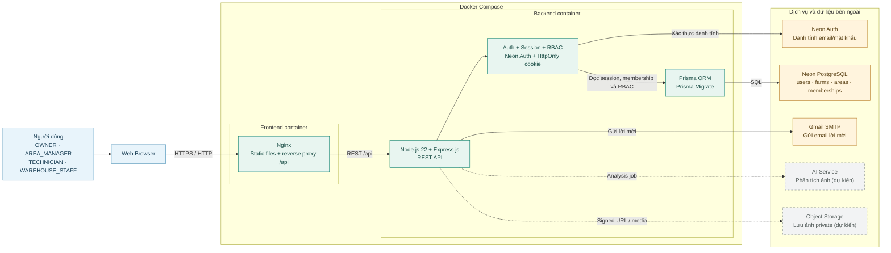
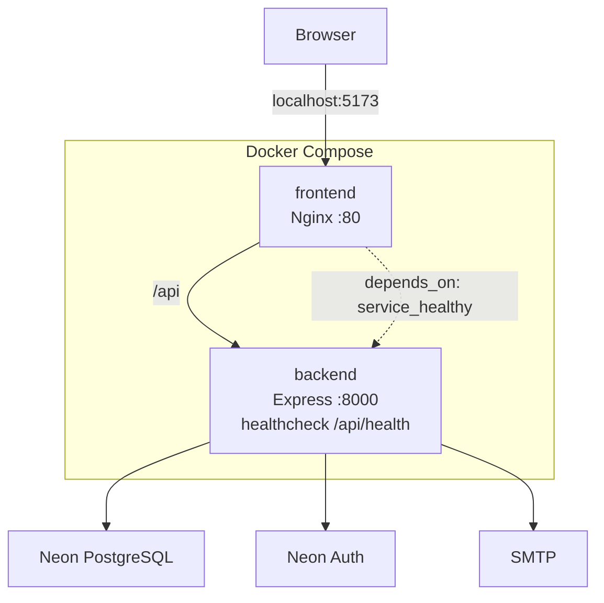

# Kiến trúc hiện tại

## Sơ đồ kiến trúc hệ thống

Sơ đồ dưới đây mô tả kiến trúc Client–Server đang được sử dụng. Nét liền là thành phần/kết nối đã có trong codebase; nét đứt là thành phần được quy hoạch nhưng chưa tích hợp vào phiên bản hiện tại.

### Luồng xử lý chính

1. Người dùng truy cập giao diện web thông qua trình duyệt.
2. Nginx phục vụ frontend và chuyển các request `/api` đến Express.
3. Express xác thực danh tính qua Neon Auth, sau đó kiểm tra session ứng dụng trong `access_sessions`.
4. Middleware tải membership theo `(farm_id, user_id)` để kiểm tra role, trạng thái và phạm vi khu vực.
5. Prisma thực hiện truy vấn đến Neon PostgreSQL; mọi dữ liệu nghiệp vụ phải được giới hạn theo farm/khu vực.
6. Express sử dụng Gmail SMTP để gửi lời mời thành viên.
7. AI Service và Object Storage mới là hướng tích hợp tiếp theo, chưa phải thành phần đang chạy trong MVP.

### Sơ đồ triển khai tối giản

> Đây là quyết định kiến trúc chuẩn của ChillShrimp: hệ thống vận hành theo mô hình **multi-farm**; danh tính nằm ở `users`, còn role và trạng thái truy cập nằm ở `farm_members` theo từng trang trại.

## 1. Các lớp hệ thống

- Frontend `FE/`: Vue 3, Vite, Vuetify và Vue Router. Frontend chỉ gọi REST API, không giữ database URL, khóa SMTP hoặc bí mật xác thực.
- Backend `BE/`: Node.js và Express. Backend xác thực qua Neon Auth, kiểm tra phiên ứng dụng trong `access_sessions`, thực thi RBAC và gọi Prisma.
- Database: Neon PostgreSQL. Prisma schema và Prisma Migrate là nguồn quản lý cấu trúc dữ liệu.
- Dịch vụ ngoài: SMTP gửi email; `AI_SERVICE` và object storage sẽ được tích hợp ở các giai đoạn nghiệp vụ sau.

## 2. Mô hình multi-farm và phân quyền

- `users` là danh tính dùng chung toàn hệ thống, không chứa role toàn cục.
- `farms` là tenant. Một tài khoản có thể tạo hoặc tham gia nhiều farm.
- `farm_members` là nguồn duy nhất để xác định quyền nghiệp vụ, với khóa chính ghép `(farm_id, user_id)`.
- Mỗi membership có đúng một `role`, một `status` và có thể có `area_id`. Cùng một user có thể giữ role khác nhau ở các farm khác nhau.
- Bốn role nghiệp vụ là `owner`, `area_manager`, `technician`, `warehouse_staff`. Không có role `admin`, `manager`, `staff` hoặc `viewer` trong kiến trúc đã chốt.
- `ADMIN_EMAIL` chỉ là cơ chế bootstrap cho tài khoản đầu tiên được phép tạo farm; nó không phải role và không thay thế `farm_members`.
- `farms.created_by` chỉ dùng để truy vết người tạo. Về nguyên tắc, quyền Owner phải được lấy từ membership `active` của chính farm đang thao tác.

## 3. Luồng xác thực và ủy quyền

1. Neon Auth xác thực email/mật khẩu và duy trì cookie phiên.
2. Backend đối chiếu user Neon Auth với `users`, sau đó kiểm tra phiên ứng dụng trong `access_sessions`.
3. Frontend gửi `farmId` của farm đang chọn trong path, query hoặc body tùy endpoint.
4. Backend tải `farm_members` bằng cặp `(farmId, userId)` và từ chối nếu không có membership hoặc `status = suspended`.
5. Backend kiểm tra `role` và `area_id`, sau đó mới đọc/ghi dữ liệu thuộc farm tương ứng.

Mọi query nghiệp vụ phải có `farm_id` trực tiếp hoặc suy ra được farm qua quan hệ cha. Không được tin `role`, `area_id` hoặc `farm_id` do frontend tự khai báo nếu chưa đối chiếu với database.

## 4. Luồng lời mời theo kiến trúc đích

Owner chọn farm, email, role và khu vực nếu cần. Backend tạo `farm_invitations`; khi người nhận chấp nhận, hệ thống tạo thêm một dòng `farm_members` mà không thay đổi membership của họ tại các farm khác. User mới đăng ký Neon Auth, còn user đã tồn tại phải đăng nhập đúng tài khoản trước khi nhận thêm farm.

## 5. Trạng thái hiện thực và khoảng cách còn lại

Schema Prisma đã có `users`, `farms`, `areas`, `farm_members`, `farm_invitations`, `access_sessions` và `password_reset_otp_windows`. Giao diện đã có farm context và có thể chọn giữa các membership được API trả về.

Các điểm sau chưa khớp hoàn toàn với kiến trúc đã chốt:

- Migration đã áp dụng `20260902_004_enforce_single_farm_non_owner` còn giới hạn role không phải Owner ở một farm.
- API tạo lời mời hiện từ chối email đã tồn tại, nên chưa có luồng thêm một user hiện hữu vào farm thứ hai.
- Farm selector trên giao diện hiện chỉ hiển thị khi user là Owner của ít nhất một farm, chưa phù hợp với user có nhiều membership nhưng không giữ role Owner.
- API xóa farm hiện kiểm tra `farms.created_by` thay vì middleware Owner theo `farm_members`.
- Các bảng nghiệp vụ chuyên ngành và `ponds_tanks.area_id` vẫn thuộc lộ trình triển khai.

Theo yêu cầu hiện tại, không sửa hoặc thêm migration. Khi được triển khai sau này, phải tạo migration hiệu chỉnh mới; không sửa migration đã chạy trên Neon.
