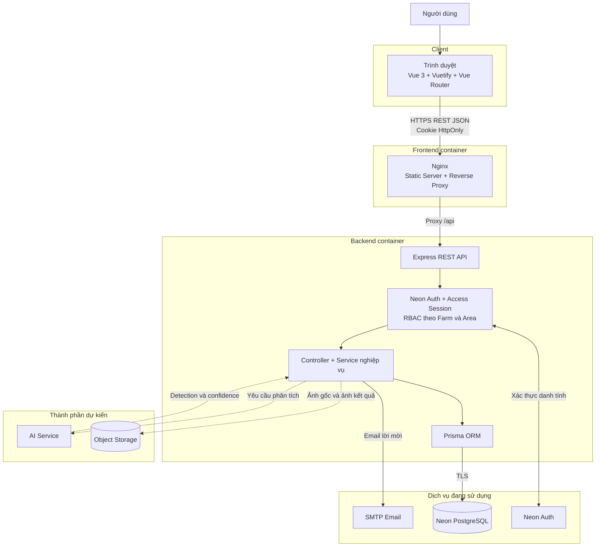
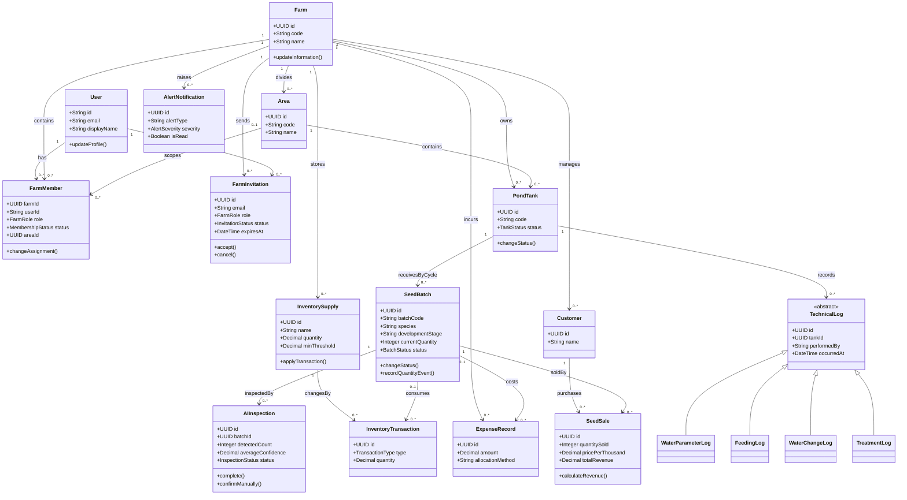
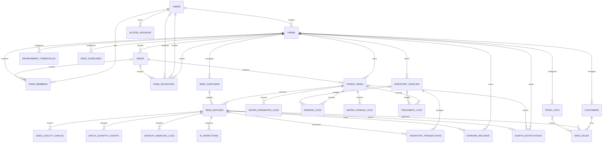

# BÁO CÁO PHÂN TÍCH VÀ THIẾT KẾ HỆ THỐNG CHILLSHRIMP

> **Tên đề tài đề xuất:** Hệ thống quản lý trại ương và xuất bán tôm giống ứng dụng xử lý ảnh và AI.
>
> **Nguồn đặc tả:** [SRS.md](./SRS.md), [USECASE.md](./USECASE.md), [USECASE-SPECIFICATION.md](./USECASE-SPECIFICATION.md), [DATABASE.md](./DATABASE.md), [ERD.md](./ERD.md) và [ARCHITECTURE.md](./ARCHITECTURE.md).
>
> Tài liệu này trình bày kiến trúc và chức năng mục tiêu của đề tài. Codebase hiện tại mới hoàn thiện phần lõi gồm xác thực, phiên đăng nhập, hồ sơ, trang trại, khu vực, thành viên và lời mời; các module nghiệp vụ tôm giống, kho, tài chính và AI thuộc lộ trình phát triển tiếp theo.

# CHƯƠNG 1. GIỚI THIỆU ĐỀ TÀI

## 1.1. Tổng quan

Hoạt động của một trại ương tôm giống phát sinh nhiều dữ liệu liên quan chặt chẽ với nhau, gồm nguồn gốc lô giống, ao/bể tiếp nhận, số lượng ban đầu, tình trạng môi trường, lịch cho ăn, thay nước, sử dụng thuốc/chế phẩm, vật tư, chi phí, kết quả kiểm tra chất lượng và quá trình xuất bán. Khi những dữ liệu này được ghi chép rời rạc bằng sổ tay hoặc bảng tính, người quản lý gặp khó khăn trong việc truy vết lịch sử, đối chiếu số liệu, kiểm soát tồn kho và đánh giá hiệu quả của từng lô.

ChillShrimp được đề xuất như một hệ thống web-first giúp số hóa quy trình **tiếp nhận, ương, chăm sóc, kiểm tra và xuất bán tôm giống**. Dữ liệu được tổ chức theo trang trại, khu vực, ao/bể và lô giống. Người dùng truy cập hệ thống theo vai trò và phạm vi được phân công thay vì sử dụng một quyền chung cho toàn hệ thống.

Điểm khác biệt của đề tài là định hướng tích hợp xử lý ảnh và AI. Kỹ thuật viên lấy mẫu tôm giống, đặt mẫu vào khay hoặc đĩa kiểm tra trong điều kiện chụp tương đối chuẩn hóa, sau đó tải ảnh lên hệ thống. AI hỗ trợ phát hiện và đếm cá thể, tính mật độ khi có thể tích mẫu, lưu confidence và cung cấp dữ liệu tham khảo cho người vận hành. AI không thay thế kết luận chuyên môn và không tự chẩn đoán bệnh.

Đầu ra sản xuất được quản lý trong đề tài là **con giống ở giai đoạn PL được bán theo số lượng**, thường áp dụng đơn giá trên 1.000 con. Hệ thống không hướng đến quản lý tôm thương phẩm bán theo khối lượng và không bao phủ toàn bộ quy trình hatchery từ tôm bố mẹ, sinh sản, trứng đến nauplius.

Quy trình nghiệp vụ tổng quát:

```text
Tiếp nhận lô giống
        ↓
Kiểm tra chất lượng đầu vào
        ↓
Phân lô vào ao/bể ương
        ↓
Theo dõi môi trường và chăm sóc
        ↓
Lấy mẫu và kiểm tra bằng AI
        ↓
Theo dõi số lượng, vật tư và chi phí
        ↓
Lô đạt trạng thái sẵn sàng bán
        ↓
Xuất bán con giống
        ↓
Tổng hợp doanh thu, cảnh báo và báo cáo
```

## 1.2. Mục tiêu đề tài

### 1.2.1. Mục tiêu tổng quát

Xây dựng hệ thống phần mềm hỗ trợ quản lý tập trung hoạt động của trại ương tôm giống, bảo đảm dữ liệu có thể truy vết theo từng trang trại, khu vực, ao/bể và lô giống; đồng thời tích hợp AI ở mức hỗ trợ kiểm tra mẫu và ra quyết định.

### 1.2.2. Mục tiêu cụ thể

1. Xây dựng cơ chế đăng nhập, phiên truy cập và hồ sơ người dùng an toàn.
2. Hỗ trợ mô hình nhiều trang trại; quyền được xác định riêng theo membership của người dùng tại từng trang trại.
3. Quản lý khu vực, ao/bể, lô giống và trạng thái trong toàn bộ chu kỳ ương.
4. Số hóa nhật ký môi trường, cho ăn, thay nước, thuốc/chế phẩm, kiểm tra chất lượng và biến động số lượng.
5. Quản lý vật tư và toàn bộ lịch sử nhập, xuất, sử dụng, điều chỉnh tồn kho.
6. Tích hợp AI để lưu ảnh mẫu, phát hiện cá thể, đếm, tính mật độ, lưu confidence và kết quả hiệu chỉnh thủ công.
7. Theo dõi chi phí, giá vốn, khách hàng, bảng giá, giao dịch xuất bán và doanh thu.
8. Sinh cảnh báo theo cấu hình môi trường, kết quả AI và ngưỡng tồn kho.
9. Cung cấp dashboard và báo cáo theo đúng phạm vi quyền của từng vai trò.
10. Xây dựng kiến trúc có thể mở rộng sang PWA/mobile wrapper, IoT, xử lý bất đồng bộ và mô hình AI tốt hơn.

## 1.3. Phạm vi đề tài

### 1.3.1. Phạm vi nghiệp vụ

Hệ thống nằm trong phạm vi quản lý sau:

- Trang trại, khu vực, thành viên và phân quyền theo từng trang trại.
- Ao/bể ương và quy tắc một ao/bể chỉ có tối đa một lô đang chiếm dụng tại một thời điểm.
- Tiếp nhận lô giống, nguồn cung cấp, hồ sơ kiểm dịch và kiểm tra chất lượng đầu vào.
- Theo dõi lô giống từ khi thả đến khi `ready_for_sale`, `sold`, `failed` hoặc `cancelled`.
- Nhật ký môi trường, cho ăn, thay nước, thuốc/chế phẩm và lấy mẫu tăng trưởng.
- Kiểm tra mẫu tôm giống bằng AI và lưu lịch sử phân tích.
- Danh mục vật tư, nhập kho, cấp phát, sử dụng và điều chỉnh tồn.
- Chi phí, khách hàng, bảng giá và xuất bán con giống.
- Dashboard, cảnh báo và báo cáo theo phạm vi quyền.

MVP ưu tiên tôm thẻ chân trắng (`white_leg_shrimp`) ở giai đoạn PL. Tôm sú (`black_tiger_shrimp`) chỉ được áp dụng khi có cấu hình ngưỡng, định mức và bảng giá riêng phù hợp.

### 1.3.2. Các actor trong hệ thống

| Actor | Loại | Phạm vi | Trách nhiệm chính |
|---|---|---|---|
| `OWNER` | Người dùng | Toàn bộ trang trại có membership Owner | Quản lý trại, nhân viên, sản xuất, kho, tài chính, khách hàng, bán giống, báo cáo và cảnh báo |
| `AREA_MANAGER` | Người dùng | Khu vực được phân công | Quản lý ao/bể, lô giống và hoạt động kỹ thuật; theo dõi nhân viên và chi phí trong khu vực |
| `TECHNICIAN` | Người dùng | Khu vực được phân công | Ghi nhật ký chăm sóc, môi trường, sử dụng vật tư, chi phí phát sinh, lấy mẫu và thực hiện AI Inspection |
| `WAREHOUSE_STAFF` | Người dùng | Kho của trang trại được phân công | Quản lý danh mục vật tư, nhập/xuất kho, điều chỉnh tồn và cảnh báo kho |
| `AI_SERVICE` | Hệ thống ngoài | Yêu cầu phân tích được backend gửi đến | Nhận ảnh mẫu, thực hiện inference và trả detections, confidence cùng phiên bản model |

`users` chỉ lưu danh tính dùng chung. Role, trạng thái và khu vực được lấy từ `farm_members` theo cặp `(farm_id, user_id)`. Một tài khoản có thể tham gia nhiều trang trại và giữ role khác nhau ở mỗi trang trại.

Tiến trình tự động sinh cảnh báo là scheduler/worker nội bộ, không phải actor người dùng và không được tính thành một use case độc lập.

### 1.3.3. Phạm vi tương tác giữa các vai trò (ma trận RBAC)

| Chức năng | `OWNER` | `AREA_MANAGER` | `TECHNICIAN` | `WAREHOUSE_STAFF` |
|---|---|---|---|---|
| Đăng nhập và quản lý hồ sơ cá nhân | Tài khoản của mình | Tài khoản của mình | Tài khoản của mình | Tài khoản của mình |
| Xem thông tin trang trại | Toàn trại | Trại được phân công | Trại được phân công | Trại được phân công |
| Cập nhật thông tin trang trại | Quản lý | — | — | — |
| Mời, theo dõi và hủy lời mời thành viên | Quản lý | — | — | — |
| Quản lý role, khu vực và trạng thái nhân viên | Quản lý | — | — | — |
| Xem danh sách nhân viên | Toàn trại | Khu vực của mình | — | — |
| Quản lý ao/bể | Toàn trại | Khu vực của mình | Chỉ xem khu vực | — |
| Quản lý lô giống | Toàn trại | Khu vực của mình | Xem/cập nhật kỹ thuật trong khu vực | — |
| Ghi và xem thông số môi trường | Toàn trại | Khu vực của mình | Khu vực của mình | — |
| Ghi và xem nhật ký cho ăn | Toàn trại | Khu vực của mình | Khu vực của mình | — |
| Ghi và xem nhật ký thay nước | Toàn trại | Khu vực của mình | Khu vực của mình | — |
| Ghi và xem thuốc/chế phẩm | Toàn trại | Khu vực của mình | Khu vực của mình | — |
| Thực hiện AI Inspection | Toàn trại | Khu vực của mình | Khu vực của mình | — |
| Xem kết quả và lịch sử AI | Toàn trại | Khu vực của mình | Khu vực của mình | — |
| Quản lý danh mục vật tư | Quản lý | Chỉ xem | Chỉ xem | Quản lý |
| Nhập kho vật tư | Quản lý | — | — | Thực hiện |
| Yêu cầu cấp vật tư | Thực hiện | Thực hiện | — | — |
| Xuất/cấp vật tư khỏi kho | Quản lý | — | — | Thực hiện |
| Ghi nhận sử dụng vật tư | Quản lý | — | Thực hiện | — |
| Điều chỉnh tồn kho | Quản lý | — | — | Thực hiện |
| Quản lý chi phí | Toàn trại | Chỉ xem khu vực | Ghi chi phí phát sinh | — |
| Quản lý khách hàng | Quản lý | — | — | — |
| Xuất bán con giống | Thực hiện | — | — | — |
| Xem doanh thu | Toàn trại | — | — | — |
| Xem/đánh dấu cảnh báo | Toàn trại | Cảnh báo khu vực | Cảnh báo khu vực | Cảnh báo kho |
| Dashboard và báo cáo | Toàn trại | Dữ liệu khu vực | Dữ liệu kỹ thuật khu vực | Dữ liệu kho |

**Quy ước đọc ma trận:**

- `—`: không có quyền truy cập chức năng.
- **Toàn trại/Quản lý:** được xem hoặc thao tác trên dữ liệu của farm đang chọn, không có nghĩa là có quyền trên mọi farm trong hệ thống.
- **Khu vực của mình:** backend phải lọc theo `area_id` trong membership đang `active`.
- **Chỉ xem:** không được tạo, sửa, xóa hoặc làm thay đổi trạng thái dữ liệu.
- Quyền phải được backend kiểm tra từ `farm_members`; frontend chỉ dùng ma trận để điều khiển trải nghiệm hiển thị.

Không sử dụng role `VIEWER`, `STAFF`, `MANAGER` hoặc `ADMIN` trong mô hình nghiệp vụ đã chốt. `AI_SERVICE` là hệ thống ngoài nên không nằm trong ma trận RBAC của người dùng; quyền gọi AI phải được kiểm soát bằng cơ chế xác thực service riêng.

> **Khoảng cách hiện thực:** ma trận trên là yêu cầu đích theo `USECASE.md` và SRS. Code hiện tại còn cho phép Area Manager mời hoặc cập nhật Technician trong khu vực; hành vi này phải được điều chỉnh hoặc được phê duyệt lại trước khi nghiệm thu RBAC.

### 1.3.4. Ngoài phạm vi

- Quản lý đầy đủ tôm bố mẹ, sinh sản, trứng, nauplius và toàn bộ hatchery.
- Quản lý tôm thương phẩm để xuất khẩu theo khối lượng.
- Chẩn đoán bệnh hoặc tự động chỉ định thuốc bằng AI.
- Camera AI hoặc video realtime 24/7.
- IoT bắt buộc trong MVP.
- Thanh toán trực tuyến, hóa đơn điện tử, logistics và kế toán đầy đủ.
- Ứng dụng React Native riêng; phiên bản mobile có thể triển khai bằng responsive web, PWA hoặc wrapper.
- Workflow phê duyệt nhiều cấp và quản lý bán hàng phức tạp.

### 1.3.5. Phạm vi hiện thực của codebase hiện tại

| Nhóm | Hiện trạng |
|---|---|
| Xác thực, phiên và hồ sơ | Đã có Neon Auth, `access_sessions`, đăng nhập, đăng xuất và cập nhật hồ sơ |
| Trang trại và phân quyền lõi | Đã có `farms`, `areas`, `farm_members`, role và trạng thái membership |
| Thành viên và lời mời | Đã có API và SMTP; luồng multi-farm cho user hiện hữu còn khoảng cách cần hoàn thiện |
| Ao/bể, lô giống và nhật ký | Đã có thiết kế trong tài liệu, chưa có Prisma model/API đầy đủ |
| Kho, tài chính và bán giống | Đã có thiết kế trong tài liệu, chưa hiện thực đầy đủ |
| AI, lưu trữ ảnh và cảnh báo nền | Mới có hợp đồng/định hướng, chưa có dịch vụ chạy thực tế |

## 1.4. Yêu cầu chức năng

| Mã nhóm | Nhóm yêu cầu | Nội dung chính | Use case liên quan |
|---|---|---|---|
| FR01 | Xác thực và hồ sơ | Đăng nhập, đăng xuất, kiểm tra phiên, xem và cập nhật hồ sơ cá nhân | UC01, UC02 |
| FR02 | Nhân viên và phân quyền | Mời thành viên, quản lý membership, role, trạng thái và xem nhân viên theo khu vực | UC03, UC03.1-UC03.3 |
| FR03 | Trang trại và ao/bể | Xem/cập nhật trại, CRUD ao/bể, cập nhật trạng thái và kiểm soát phạm vi khu vực | UC04, UC04.1-UC04.3 |
| FR04 | Lô giống và chăm sóc | CRUD lô, chuyển trạng thái, môi trường, cho ăn, thay nước, thuốc/chế phẩm | UC05, UC05.1-UC05.6 |
| FR05 | Phân tích AI | Tải ảnh, tạo inspection, nhận kết quả, xem lịch sử và xác nhận thủ công | UC06, UC06.1-UC06.2 |
| FR06 | Vật tư | CRUD vật tư, nhập kho, yêu cầu cấp, xuất/cấp, ghi sử dụng và điều chỉnh tồn | UC07, UC07.1-UC07.6 |
| FR07 | Tài chính và bán giống | Chi phí, khách hàng, bảng giá, xuất bán, cập nhật số lượng lô và doanh thu | UC08, UC08.1-UC08.6 |
| FR08 | Thống kê và cảnh báo | Dashboard, cảnh báo toàn trại, cảnh báo khu vực và cảnh báo tồn kho | UC09, UC09.1-UC09.4 |

Các yêu cầu chức năng phải tuân theo Business Rules trong [SRS.md](./SRS.md#7-business-rules), đặc biệt là phạm vi tenant, một lô đang chiếm dụng trên mỗi ao/bể, lịch sử biến động số lượng, tính nguyên tử của kho/xuất bán và giới hạn kết luận của AI.

Các mục sau mô tả yêu cầu chức năng mục tiêu. Một số chức năng nghiệp vụ chưa có đầy đủ API hoặc Prisma model trong codebase hiện tại và phải được triển khai theo lộ trình.

### 1.4.1. Chủ trang trại - Owner

- Owner đăng nhập bằng tài khoản cá nhân, xem/cập nhật hồ sơ và chọn một trang trại từ các membership đang `active` của mình.
- Owner được tạo trang trại mới, xem và cập nhật thông tin trang trại. Khi tạo trại, hệ thống đồng thời tạo một membership `role = owner` cho người tạo.
- Quyền của Owner chỉ có hiệu lực trong farm tương ứng; `ADMIN_EMAIL` và `farms.created_by` không tạo quyền quản trị toàn hệ thống.
- Owner quản lý khu vực, danh sách thành viên, trạng thái membership và phân công role/khu vực cho nhân viên.
- Owner được gửi, theo dõi và hủy lời mời. Các role được mời gồm `area_manager`, `technician`, `warehouse_staff`; không tạo Owner qua luồng mời nhân viên.
- Owner quản lý toàn bộ ao/bể của trại, gồm mã, tên, loại, thể tích, khu vực và trạng thái vận hành.
- Owner quản lý lô tôm giống, nguồn cung cấp, loài, giai đoạn PL, số lượng theo chứng từ, số lượng thực tế, ngày thả, ngày dự kiến bán, hồ sơ kiểm dịch, kết quả kiểm tra chất lượng và trạng thái lô.
- Owner xem hoặc ghi các thông số môi trường, nhật ký cho ăn, thay nước và sử dụng thuốc/chế phẩm của tất cả ao/bể trong trại.
- Owner thực hiện AI Inspection và xem ảnh nguồn, ảnh có bounding box, số lượng phát hiện trong mẫu, mật độ mẫu, confidence, phiên bản model và kết quả xác nhận thủ công.
- Owner quản lý danh mục vật tư, nhập/xuất kho, lượng sử dụng, điều chỉnh tồn và lịch sử giao dịch kho.
- Owner quản lý chi phí trực tiếp theo lô và chi phí chung toàn trại; lựa chọn phương pháp phân bổ khi tính giá vốn.
- Owner quản lý khách hàng, bảng giá và xuất bán con giống. Mỗi giao dịch phải lưu số lượng, giá trên 1.000 con, phụ phí, phí vận chuyển, chiết khấu, doanh thu và snapshot tỷ lệ sống tại thời điểm bán.
- Owner xem toàn bộ cảnh báo môi trường, AI và tồn kho của trại; có thể đánh dấu cảnh báo đã đọc.
- Owner xem dashboard và báo cáo toàn trại về ao/bể, lô giống, môi trường, số lượng, tồn kho, chi phí, doanh thu và lợi nhuận khi đủ dữ liệu.

### 1.4.2. Trưởng khu vực - Area Manager

- Area Manager đăng nhập bằng tài khoản được cấp membership `active` và phải được phân công đúng một `area_id` trong trang trại.
- Area Manager được xem thông tin cơ bản của trang trại và danh sách nhân viên thuộc khu vực của mình; không được mời thành viên hoặc quản lý tài khoản nhân viên.
- Area Manager quản lý ao/bể và lô giống trong khu vực được phân công, gồm tạo/cập nhật dữ liệu được phép và chuyển trạng thái theo business rule.
- Area Manager không được đọc hoặc thay đổi ao/bể, lô giống và dữ liệu vận hành thuộc khu vực khác dù biết ID của bản ghi.
- Area Manager được ghi và xem thông số môi trường, nhật ký cho ăn, thay nước và thuốc/chế phẩm trong khu vực.
- Area Manager được lấy mẫu, thực hiện AI Inspection và xem lịch sử AI của các lô thuộc khu vực.
- Area Manager được xem danh mục vật tư và tạo yêu cầu cấp vật tư theo quy trình; không được nhập kho hoặc điều chỉnh số tồn.
- Area Manager được xem chi phí có thể truy về lô/khu vực của mình; không được xem chi phí chung chưa phân bổ hoặc doanh thu toàn trại.
- Area Manager xem dashboard và cảnh báo môi trường/AI trong khu vực được phân công.
- Area Manager không được quản lý khách hàng hoặc thực hiện xuất bán con giống.

### 1.4.3. Kỹ thuật viên - Technician

- Technician đăng nhập bằng tài khoản được cấp membership `active` và chỉ làm việc trong khu vực được phân công.
- Technician được xem thông tin trang trại, ao/bể và lô giống trong khu vực; chỉ cập nhật các thông tin kỹ thuật được cho phép, không tự thay đổi role, area hoặc trạng thái membership.
- Technician ghi thông số môi trường với thời gian, phương pháp/thiết bị đo và các chỉ số thực tế. Thông số không đo phải để `NULL`, không ghi 0 thay cho dữ liệu thiếu.
- Technician ghi nhật ký cho ăn, gồm thức ăn, lượng thực tế, đơn vị, thời gian, lượng khuyến nghị và kết quả kiểm tra thức ăn thừa nếu có.
- Technician ghi tỷ lệ thay nước, thời gian thực hiện và ghi chú liên quan.
- Technician ghi thuốc/chế phẩm, số lượng, đơn vị, mục đích và thời gian sử dụng. Hệ thống không tự chỉ định thuốc hoặc kết luận điều trị.
- Technician ghi kết quả lấy mẫu tăng trưởng và biến động số lượng theo nghiệp vụ được phân quyền; số lượng lô sau biến động không được âm.
- Technician lấy mẫu tôm giống, chụp/tải ảnh, nhập thể tích mẫu nếu có và thực hiện AI Inspection cho lô thuộc khu vực.
- Technician xem ảnh nguồn, bounding box, detections, confidence và các chỉ số AI; có thể nhập `manual_count` hoặc `correction_factor` nhưng không được ghi đè kết quả AI gốc.
- Technician xem danh mục vật tư và ghi nhận lượng vật tư thực tế đã sử dụng. Nếu nhật ký liên kết vật tư kho, việc lưu nhật ký và trừ tồn phải cùng thành công hoặc cùng rollback.
- Technician được ghi chi phí phát sinh từ công việc kỹ thuật nhưng không quản lý toàn bộ tài chính, khách hàng, bảng giá hoặc doanh thu.
- Technician xem dashboard kỹ thuật và cảnh báo thuộc khu vực; có thể đánh dấu đã đọc nhưng không có workflow cập nhật trạng thái "đang xử lý/đã xử lý" trong schema hiện tại.

### 1.4.4. Nhân viên kho - Warehouse Staff

- Warehouse Staff đăng nhập bằng membership `active` của trang trại và không gắn khu vực trong mô hình hiện tại.
- Warehouse Staff được xem thông tin cơ bản của trang trại để xác định đúng phạm vi kho đang thao tác.
- Warehouse Staff quản lý danh mục vật tư, gồm tên, nhóm, đơn vị, đơn giá tham chiếu, số tồn và ngưỡng cảnh báo.
- Warehouse Staff ghi nhận nhập kho và xuất/cấp vật tư. Mỗi thay đổi số tồn phải tạo `inventory_transactions` tương ứng.
- Warehouse Staff được điều chỉnh tồn sau kiểm kê nhưng bắt buộc ghi số lượng chênh lệch và lý do; không được sửa trực tiếp số tồn mà không có giao dịch.
- Hệ thống phải từ chối xuất vật tư nếu số lượng sau giao dịch âm và phải kiểm soát các request đồng thời.
- Warehouse Staff xem lịch sử giao dịch, danh sách vật tư dưới ngưỡng, dashboard kho và cảnh báo tồn kho.
- Warehouse Staff không được quản lý ao/bể, lô giống, nhật ký kỹ thuật, AI, chi phí, khách hàng, xuất bán hoặc doanh thu.

### 1.4.5. Chức năng xử lý ảnh và AI

AI Service là hệ thống ngoài và hiện thuộc kiến trúc mục tiêu. Luồng xử lý dự kiến:

1. Backend tiếp nhận ảnh mẫu tôm giống, `batch_id`, phương pháp lấy mẫu và `sample_volume_ml` nếu có.
2. Backend kiểm tra định dạng, kích thước ảnh và quyền truy cập lô trước khi tạo `ai_inspections` với trạng thái `pending`.
3. Ảnh được lưu tại object storage; backend gửi yêu cầu phân tích đến AI Service và chuyển trạng thái sang `processing`.
4. AI Service phát hiện cá thể tôm giống và trả class, bounding box, confidence cùng `model_version`.
5. Backend kiểm tra response, lưu detections, tính `detected_count` và `average_confidence`.
6. Khi `sample_volume_ml > 0`, hệ thống tính `density_per_ml = detected_count / sample_volume_ml`; nếu thiếu thể tích thì để mật độ là `NULL`.
7. Backend lưu ảnh chú thích nếu có và chuyển inspection sang `completed`; lỗi xử lý phải chuyển sang `failed` cùng thông tin lỗi phù hợp.
8. Người dùng có quyền xem ảnh nguồn, ảnh kết quả và lịch sử; kỹ thuật viên có thể lưu số đếm xác nhận/hệ số hiệu chỉnh riêng.

`average_size_mm` và `uniformity_score` chỉ được sử dụng khi pipeline có phương pháp đo và hiệu chuẩn phù hợp. AI không tự chẩn đoán bệnh, tự kết luận chất lượng lô hoặc tự động quyết định sử dụng thuốc.

### 1.4.6. Chức năng cảnh báo và thông báo

- Hệ thống sinh cảnh báo môi trường khi số đo vượt ngưỡng đang hoạt động, còn hiệu lực, có nguồn tham chiếu và đã được phê duyệt.
- Hệ thống có thể sinh cảnh báo AI khi kết quả thỏa điều kiện bất thường đã được cấu hình; confidence thấp chỉ yêu cầu kiểm tra thủ công, không tự kết luận lô không đạt.
- Hệ thống sinh cảnh báo tồn kho khi `inventory_supplies.quantity <= min_threshold`.
- Cảnh báo có ba mức `info`, `warning`, `critical` và phải truy được farm, dữ liệu nguồn, thời điểm, loại cùng nội dung cảnh báo.
- Việc sinh cảnh báo là tiến trình nền hoặc bước xử lý sau khi ghi dữ liệu, không phải một use case do người dùng chủ động kích hoạt.
- Owner xem cảnh báo toàn trại; Area Manager và Technician chỉ xem cảnh báo khu vực; Warehouse Staff chỉ xem cảnh báo kho.
- Người dùng có quyền được xem chi tiết và đánh dấu cảnh báo đã đọc. Schema hiện tại chỉ có `is_read` chung, chưa hỗ trợ trạng thái đọc riêng từng user hoặc workflow `đang xử lý/đã xử lý`.
- Job tạo cảnh báo phải có cơ chế chống trùng cho cùng nguồn và cùng điều kiện cảnh báo.

### 1.4.7. Chức năng báo cáo và thống kê

- Dashboard hiển thị số ao/bể theo trạng thái, số lô `active`/`ready_for_sale`, thông số gần nhất, cảnh báo chưa đọc và thời điểm cập nhật dữ liệu.
- Hệ thống hiển thị xu hướng các thông số môi trường theo ao/bể, lô có thể suy ra và khoảng thời gian.
- Báo cáo lô sử dụng `initial_quantity`, `current_estimated_quantity`, lịch sử `batch_quantity_events`, dữ liệu lấy mẫu và tỷ lệ sống; không coi số cá thể AI phát hiện trong một ảnh mẫu là số lượng toàn lô nếu chưa có công thức hiệu chuẩn.
- Báo cáo kho tổng hợp số tồn, nhập, xuất, sử dụng, điều chỉnh và danh sách dưới ngưỡng.
- Báo cáo tài chính tổng hợp chi phí trực tiếp, chi phí chung đã phân bổ, giá vốn, doanh thu và lợi nhuận khi đủ dữ liệu nguồn.
- Báo cáo bán hàng tổng hợp số lượng xuất bán và doanh thu theo thời gian, lô và khách hàng từ các snapshot trong `seed_sales`.
- Owner xem báo cáo toàn trại; Area Manager xem báo cáo khu vực; Technician xem dữ liệu kỹ thuật khu vực; Warehouse Staff xem báo cáo kho.
- Người dùng được lọc dữ liệu theo khoảng thời gian và đối tượng trong phạm vi quyền. Backend phải áp dụng lại điều kiện farm/area cho mọi truy vấn tổng hợp.

## 1.5. Yêu cầu phi chức năng

| Nhóm | Yêu cầu |
|---|---|
| Hiệu năng | CRUD thông thường phải phản hồi phù hợp với ứng dụng web; danh sách lớn phải phân trang; query lọc theo farm, area, trạng thái và thời gian cần index phù hợp |
| Bảo mật | Mật khẩu không lưu tại database nghiệp vụ; cookie xác thực dùng HttpOnly; backend kiểm tra session, membership, role, area và tenant cho từng request |
| Toàn vẹn dữ liệu | Sử dụng khóa ngoại, unique/check constraint và transaction cho lời mời, tồn kho, biến động số lượng và xuất bán |
| Cô lập tenant | Không trả hoặc thay đổi dữ liệu của farm/khu vực khác kể cả khi client gửi UUID hợp lệ của bản ghi đó |
| Khả dụng | Giao diện responsive; form có validation; danh sách có loading, empty và error state; thao tác nguy hiểm phải xác nhận |
| Khả năng bảo trì | Frontend, backend, AI và truy cập dữ liệu được tách theo module; enum và trạng thái được định nghĩa thống nhất; migration được quản lý bằng source code |
| Khả năng mở rộng | Có thể mở rộng nhiều farm, xử lý AI bất đồng bộ, object storage, IoT và thông báo realtime mà không cho client truy cập trực tiếp secret |
| Truy vết | Nhật ký kỹ thuật, kết quả AI, giao dịch kho, chi phí và bán hàng phải lưu người thực hiện, thời gian nghiệp vụ và dữ liệu nguồn |
| Tin cậy AI | Lưu `model_version`, confidence, ảnh nguồn và kết quả gốc; lỗi AI không làm mất dữ liệu nghiệp vụ; AI chỉ hỗ trợ quyết định |
| Triển khai | Hệ thống chạy được bằng Docker Compose; frontend và backend nhận cấu hình qua biến môi trường; database cloud không đóng gói trong container local |

# CHƯƠNG 2. CƠ SỞ LÝ THUYẾT VÀ CÔNG NGHỆ SỬ DỤNG

## 2.1. Kiến trúc Client-Server và REST API

Kiến trúc Client-Server tách giao diện người dùng khỏi nơi xử lý nghiệp vụ và lưu trữ dữ liệu. Trong ChillShrimp, trình duyệt đóng vai trò client; Express là application server; Neon PostgreSQL là tầng dữ liệu. Client giao tiếp với server qua REST API sử dụng HTTP/HTTPS và JSON.

Ưu điểm của mô hình này:

- Tập trung validation, phân quyền và business rule tại backend.
- Không để database URL, mật khẩu SMTP hoặc khóa dịch vụ AI ở frontend.
- Frontend và backend có thể phát triển, kiểm thử và triển khai tương đối độc lập.
- Nhiều loại client trong tương lai có thể dùng chung API.
- Dễ mở rộng theo chiều ngang khi phiên và dữ liệu dùng chung được đặt ở dịch vụ trung tâm.

## 2.2. Công nghệ frontend

| Công nghệ | Tổng quan | Ưu điểm | Vai trò trong ChillShrimp |
|---|---|---|---|
| Vue.js 3 | Framework JavaScript xây dựng giao diện theo component và reactive state | Dễ tổ chức giao diện, cập nhật dữ liệu hiệu quả, Composition API phù hợp tái sử dụng logic | Xây dựng SPA, form, bảng dữ liệu và dashboard |
| Vite | Công cụ phát triển và build frontend | Khởi động nhanh, hỗ trợ hot reload và tạo bundle production gọn | Chạy môi trường dev và build Vue thành static assets |
| Vuetify | Thư viện UI component dành cho Vue theo hướng Material Design | Có sẵn form, bảng, dialog, navigation và responsive grid; giao diện nhất quán | Tạo giao diện quản trị và nhập liệu nghiệp vụ |
| Vue Router | Bộ định tuyến phía client | Điều hướng SPA không tải lại toàn trang, hỗ trợ route guard và metadata | Bảo vệ trang đăng nhập, hồ sơ và các màn hình nghiệp vụ |
| Fetch API | API HTTP có sẵn trong trình duyệt | Không cần thêm thư viện HTTP, hỗ trợ Promise và tùy chỉnh cookie/header | Gọi REST API với JSON và `credentials: include` |

Vue chỉ chịu trách nhiệm giao diện và trạng thái trình bày. Mọi phân quyền quan trọng vẫn phải được backend kiểm tra lại.

## 2.3. Công nghệ backend và xác thực

| Công nghệ | Tổng quan | Ưu điểm | Vai trò trong ChillShrimp |
|---|---|---|---|
| Node.js 22 | Môi trường chạy JavaScript phía server theo mô hình I/O bất đồng bộ | Dùng cùng ngôn ngữ với frontend, phù hợp REST API và tích hợp dịch vụ ngoài | Runtime của backend |
| Express.js 5 | Web framework tối giản cho Node.js | Router/middleware linh hoạt, dễ tổ chức API và xử lý lỗi tập trung | Cung cấp `/api/auth`, `/api/users`, `/api/farms` và các API nghiệp vụ tiếp theo |
| Neon Auth | Dịch vụ xác thực tích hợp với Neon | Tách mật khẩu và danh tính xác thực khỏi logic nghiệp vụ | Xác thực email/mật khẩu và duy trì phiên danh tính |
| Access Session | Phiên ứng dụng được lưu trong PostgreSQL và nhận diện bằng cookie HttpOnly | Kiểm soát idle timeout, đăng xuất và thu hồi phiên ở tầng ứng dụng | Kiểm tra phiên thứ hai sau Neon Auth |
| Nodemailer/SMTP | Thư viện và giao thức gửi email | Hỗ trợ nhiều nhà cung cấp SMTP, thích hợp gửi lời mời | Gửi liên kết mời thành viên; khi thiếu cấu hình có thể ghi link ra log để kiểm thử |

Backend hiện theo kiến trúc module/layered REST API. Một số module dùng `route → controller → Prisma`, trong khi `auth` và `users` dùng handler theo nhóm HTTP method. Khi mở rộng, dự án nên chuẩn hóa theo `route → controller → service → repository/Prisma` đối với nghiệp vụ phức tạp.

## 2.4. Cơ sở dữ liệu và ORM

| Công nghệ | Tổng quan | Ưu điểm | Vai trò trong ChillShrimp |
|---|---|---|---|
| PostgreSQL | Hệ quản trị cơ sở dữ liệu quan hệ | Hỗ trợ transaction, khóa ngoại, constraint, index, JSONB và truy vấn tổng hợp | Lưu toàn bộ dữ liệu nghiệp vụ có quan hệ và yêu cầu truy vết |
| Neon PostgreSQL | PostgreSQL được cung cấp dưới dạng dịch vụ cloud | Không cần vận hành database container local, kết nối bảo mật qua TLS, thuận lợi triển khai | Database dùng chung của backend |
| Prisma ORM | ORM và bộ công cụ schema/migration cho Node.js | Model rõ ràng, sinh Prisma Client, query có kiểu và quản lý lịch sử migration | Ánh xạ model, truy vấn Neon và triển khai schema |
| Prisma Migrate | Cơ chế version hóa thay đổi schema | Cho phép review và triển khai migration theo thứ tự | Quản lý cấu trúc database giữa môi trường phát triển và Neon |

PostgreSQL phù hợp với ChillShrimp vì các nghiệp vụ bán giống, tồn kho và biến động số lượng cần transaction và ràng buộc toàn vẹn mạnh. JSONB được dùng cho dữ liệu có cấu trúc thay đổi như danh sách detection của AI, nhưng các quan hệ chính vẫn được biểu diễn bằng khóa ngoại.

## 2.5. Công nghệ triển khai

| Công nghệ | Tổng quan | Ưu điểm | Vai trò trong ChillShrimp |
|---|---|---|---|
| Docker | Đóng gói ứng dụng và dependency thành image | Môi trường nhất quán, dễ triển khai và tái tạo | Tạo image frontend và backend |
| Docker Compose | Điều phối nhiều container trong môi trường phát triển/triển khai đơn giản | Chạy toàn bộ stack bằng một lệnh và quản lý dependency | Chạy frontend, backend và healthcheck; không chạy PostgreSQL local |
| Nginx | Web server và reverse proxy | Phục vụ static file hiệu quả, hỗ trợ SPA fallback và proxy API | Phục vụ Vue build, chuyển `/api` đến backend |
| Biến môi trường | Cơ chế tách cấu hình khỏi source code | Tránh hard-code secret, dễ thay đổi theo môi trường | Lưu `DATABASE_URL`, Neon Auth, SMTP, frontend URL và API URL |

## 2.6. Cơ sở xử lý ảnh và AI

Phần AI của ChillShrimp được định hướng theo bài toán object detection trên ảnh mẫu tôm giống. Mô hình trả về danh sách đối tượng phát hiện, vị trí bounding box, class và confidence. Backend tổng hợp các detection thành số lượng, confidence trung bình và mật độ khi biết thể tích mẫu.

Các công thức cơ bản:

```text
detected_count = số detection hợp lệ

average_confidence = tổng confidence / detected_count

density_per_ml = detected_count / sample_volume_ml
```

`average_confidence` phải để `NULL` khi không có detection; `density_per_ml` chỉ được tính khi `sample_volume_ml > 0`. Kết quả thủ công như `manual_count` và `correction_factor` được lưu riêng, không ghi đè dữ liệu gốc của model.

Ưu điểm của cách tích hợp AI qua một service riêng:

- Backend nghiệp vụ không phụ thuộc trực tiếp vào framework huấn luyện/inference.
- Có thể thay model mà không thay đổi toàn bộ frontend.
- Dễ lưu phiên bản model và so sánh chất lượng kết quả.
- Phù hợp xử lý bất đồng bộ đối với ảnh lớn hoặc lượng request tăng.

AI Service, model và object storage hiện chưa được lựa chọn/triển khai hoàn chỉnh. Vì vậy các nội dung trên là cơ sở thiết kế mục tiêu, không phải mô tả một dịch vụ đang chạy.

## 2.7. Lý do lựa chọn công nghệ

Tổ hợp Vue, Vuetify và Vite phù hợp với một ứng dụng quản trị web cần nhiều form và bảng dữ liệu. Node.js và Express thuận lợi cho việc xây dựng REST API, tích hợp xác thực, SMTP và AI Service. PostgreSQL cùng Prisma đáp ứng tốt các yêu cầu về quan hệ, transaction và truy vết. Docker Compose và Nginx giúp thống nhất cách chạy giữa các máy phát triển. Neon giảm công việc vận hành database local và phù hợp với kiến trúc triển khai cloud của đề tài.

# CHƯƠNG 3. PHÂN TÍCH VÀ THIẾT KẾ HỆ THỐNG

## 3.1. Nguyên tắc phân tích và thiết kế

- Hệ thống theo kiến trúc Client-Server ba tầng: trình bày, ứng dụng và dữ liệu.
- `farms` là ranh giới tenant; mọi dữ liệu nghiệp vụ phải chứa hoặc suy ra chắc chắn được `farm_id`.
- `farm_members` là nguồn phân quyền duy nhất; role không nằm trong `users`.
- Area Manager và Technician bị giới hạn theo khu vực thông qua `area_id`.
- Nhật ký chăm sóc neo theo `tank_id`; AI Inspection neo theo `batch_id` để tránh khóa ngoại dư thừa.
- Một ao/bể chỉ có tối đa một lô `active` hoặc `ready_for_sale` tại một thời điểm.
- Dữ liệu lịch sử không bị ghi đè; thay đổi số lượng và tồn kho phải có bảng sự kiện/giao dịch.
- AI chỉ hỗ trợ đánh giá; mọi kết luận chuyên môn cần con người xác nhận.

## 3.2. Sơ đồ kiến trúc hệ thống



Đường liền thể hiện thành phần đã có trong kiến trúc hiện tại. Đường nét đứt thể hiện AI và lưu trữ ảnh thuộc kiến trúc mục tiêu.

Luồng xử lý request chính:

1. Người dùng thao tác trên Vue SPA.
2. Frontend gửi JSON và cookie đến `/api`.
3. Nginx chuyển request sang Express.
4. Backend kiểm tra Neon Auth, access session và membership tại farm đang chọn.
5. Middleware kiểm tra role, status và area trước khi gọi nghiệp vụ.
6. Service/controller dùng Prisma truy vấn Neon PostgreSQL.
7. Backend trả response JSON để frontend cập nhật giao diện.

## 3.3. Sơ đồ Use Case tổng quát

Sơ đồ Use Case tổng quát phác thảo toàn bộ chức năng mà người dùng và dịch vụ bên ngoài có thể thực hiện với **Hệ thống quản lý trại ương và xuất bán tôm giống ChillShrimp**. Hệ thống đóng vai trò trung tâm trong việc quản lý người dùng, trang trại, ao/bể, lô tôm giống, hoạt động chăm sóc, kiểm tra bằng AI, vật tư, chi phí, xuất bán, dashboard và cảnh báo. Dữ liệu được quản lý theo từng trang trại; quyền của một người dùng được xác định bởi vai trò và khu vực phụ trách trong `farm_members` của trang trại đang được chọn.

Hệ thống gồm **05 actor**, trong đó có 04 actor người dùng và 01 actor là dịch vụ bên ngoài:

- **Chủ trang trại (`OWNER`):** chịu trách nhiệm quản trị và giám sát toàn bộ hoạt động trong trang trại. Chủ trang trại có thể quản lý thành viên và phân quyền, cập nhật thông tin trang trại, quản lý ao/bể và lô giống, theo dõi các nhật ký chăm sóc, thực hiện kiểm tra AI, quản lý kho/vật tư, quản lý chi phí và khách hàng, xuất bán tôm giống, xem doanh thu, dashboard và toàn bộ cảnh báo của trang trại.
- **Trưởng khu vực (`AREA_MANAGER`):** chịu trách nhiệm điều hành hoạt động trong khu vực được phân công. Trưởng khu vực được xem nhân viên thuộc khu vực, quản lý ao/bể và lô giống trong phạm vi phụ trách, ghi nhận hoạt động chăm sóc, thực hiện và xem kết quả AI, yêu cầu cấp vật tư, xem chi phí, dashboard và cảnh báo của khu vực. Actor này không được quản lý tài khoản nhân viên, nhập/xuất kho hoặc xuất bán tôm giống.
- **Kỹ thuật viên (`TECHNICIAN`):** chịu trách nhiệm trực tiếp thực hiện nghiệp vụ kỹ thuật tại khu vực được phân công. Kỹ thuật viên được xem ao/bể và lô giống, cập nhật thông tin kỹ thuật, ghi thông số môi trường, nhật ký cho ăn, thay nước, thuốc/chế phẩm, thực hiện kiểm tra AI, ghi nhận vật tư đã sử dụng và chi phí phát sinh, đồng thời theo dõi dashboard và cảnh báo trong khu vực của mình.
- **Nhân viên kho (`WAREHOUSE_STAFF`):** chịu trách nhiệm quản lý vật tư của trang trại. Nhân viên kho được xem thông tin cơ bản của trang trại, quản lý danh mục vật tư, nhập kho, xuất/cấp vật tư, điều chỉnh tồn kho, xem dashboard kho và cảnh báo tồn kho. Actor này không tham gia quản lý lô giống, chăm sóc kỹ thuật, tài chính hoặc xuất bán.
- **Dịch vụ AI (`AI_SERVICE`):** là actor phụ trợ bên ngoài hệ thống. Dịch vụ nhận ảnh mẫu tôm giống và thông tin kiểm tra, thực hiện nhận diện/phân tích, sau đó trả về số lượng phát hiện, mật độ ước tính, kích thước, độ đồng đều, dấu hiệu bất thường và độ tin cậy để ChillShrimp lưu trữ. Dịch vụ AI không phải người dùng, không đăng nhập bằng tài khoản và không có vai trò trong `farm_members`.

Trong sơ đồ dưới đây, mỗi hình elip là **một use case thao tác cụ thể**. Các khung có tiêu đề chỉ dùng để bố trí các chức năng cùng miền nghiệp vụ, không phải use case và không thay thế các chức năng bên trong.

```mermaid
flowchart TB
    OWNER[Chủ trang trại<br/>OWNER]
    AREA[Trưởng khu vực<br/>AREA_MANAGER]
    TECH[Kỹ thuật viên<br/>TECHNICIAN]
    WAREHOUSE[Nhân viên kho<br/>WAREHOUSE_STAFF]
    AIS[Dịch vụ AI<br/>AI_SERVICE]

    subgraph SYSTEM[HỆ THỐNG CHILLSHRIMP]
        direction TB

        subgraph AUTH[Xác thực và hồ sơ]
            direction LR
            U01([1. UC01 - Đăng nhập])
            U02([2. UC02 - Quản lý hồ sơ cá nhân])
        end

        subgraph EMPLOYEE[Nhân viên và phân quyền]
            direction LR
            U031([3. UC03.1 - Mời thành viên])
            U032([4. UC03.2 - Quản lý tài khoản nhân viên])
            U033([5. UC03.3 - Xem nhân viên theo khu vực])
        end

        subgraph FARM[Trang trại và ao/bể]
            direction LR
            U041([6. UC04.1 - Xem/cập nhật thông tin trang trại])
            U042([7. UC04.2 - CRUD ao hoặc bể])
            U043([8. UC04.3 - Cập nhật trạng thái ao/bể])
        end

        subgraph CARE[Lô giống và chăm sóc]
            direction LR
            U051([9. UC05.1 - CRUD lô giống])
            U052([10. UC05.2 - Cập nhật trạng thái lô giống])
            U053([11. UC05.3 - Ghi/xem thông số môi trường])
            U054([12. UC05.4 - Ghi/xem nhật ký cho ăn])
            U055([13. UC05.5 - Ghi/xem nhật ký thay nước])
            U056([14. UC05.6 - Ghi/xem thuốc, chế phẩm])
        end

        subgraph AI[Kiểm tra và phân tích AI]
            direction LR
            U061([15. UC06.1 - Thực hiện AI Inspection])
            U062([16. UC06.2 - Xem kết quả và lịch sử AI])
        end

        subgraph INVENTORY[Kho và vật tư]
            direction LR
            U071([17. UC07.1 - CRUD danh mục vật tư])
            U072([18. UC07.2 - Nhập kho vật tư])
            U073([19. UC07.3 - Yêu cầu cấp vật tư])
            U074([20. UC07.4 - Xuất/cấp vật tư khỏi kho])
            U075([21. UC07.5 - Ghi nhận sử dụng vật tư])
            U076([22. UC07.6 - Điều chỉnh tồn kho])
        end

        subgraph FINANCE[Tài chính và bán giống]
            direction LR
            U081([23. UC08.1 - Quản lý chi phí])
            U082([24. UC08.2 - Ghi nhận chi phí phát sinh])
            U083([25. UC08.3 - Xem chi phí theo khu vực])
            U084([26. UC08.4 - CRUD khách hàng])
            U085([27. UC08.5 - Xuất bán con giống])
            U086([28. UC08.6 - Xem doanh thu])
        end

        subgraph MONITOR[Thống kê và cảnh báo]
            direction LR
            U091([29. UC09.1 - Xem Dashboard theo quyền])
            U092([30. UC09.2 - Xem cảnh báo toàn trại])
            U093([31. UC09.3 - Xem cảnh báo theo khu vực])
            U094([32. UC09.4 - Xem cảnh báo tồn kho])
        end
    end

    OWNER --- U01
    OWNER --- U02
    OWNER --- U031
    OWNER --- U032
    OWNER --- U033
    OWNER --- U041
    OWNER --- U042
    OWNER --- U043
    OWNER --- U051
    OWNER --- U052
    OWNER --- U053
    OWNER --- U054
    OWNER --- U055
    OWNER --- U056
    OWNER --- U061
    OWNER --- U062
    OWNER --- U071
    OWNER --- U072
    OWNER --- U073
    OWNER --- U074
    OWNER --- U075
    OWNER --- U076
    OWNER --- U081
    OWNER --- U082
    OWNER --- U083
    OWNER --- U084
    OWNER --- U085
    OWNER --- U086
    OWNER --- U091
    OWNER --- U092
    OWNER --- U093
    OWNER --- U094

    AREA --- U01
    AREA --- U02
    AREA --- U033
    AREA --- U041
    AREA --- U042
    AREA --- U043
    AREA --- U051
    AREA --- U052
    AREA --- U053
    AREA --- U054
    AREA --- U055
    AREA --- U056
    AREA --- U061
    AREA --- U062
    AREA --- U071
    AREA --- U073
    AREA --- U083
    AREA --- U091
    AREA --- U093

    TECH --- U01
    TECH --- U02
    TECH --- U041
    TECH --- U042
    TECH --- U051
    TECH --- U053
    TECH --- U054
    TECH --- U055
    TECH --- U056
    TECH --- U061
    TECH --- U062
    TECH --- U071
    TECH --- U075
    TECH --- U082
    TECH --- U091
    TECH --- U093

    WAREHOUSE --- U01
    WAREHOUSE --- U02
    WAREHOUSE --- U041
    WAREHOUSE --- U071
    WAREHOUSE --- U072
    WAREHOUSE --- U074
    WAREHOUSE --- U076
    WAREHOUSE --- U091
    WAREHOUSE --- U094

    AIS --- U061

    classDef actor fill:#ffffff,stroke:#263238,stroke-width:2px,color:#111827;
    classDef usecase fill:#e8f4fd,stroke:#1976d2,stroke-width:1px,color:#111827;
    class OWNER,AREA,TECH,WAREHOUSE,AIS actor;
    class U01,U02,U031,U032,U033,U041,U042,U043,U051,U052,U053,U054,U055,U056,U061,U062,U071,U072,U073,U074,U075,U076,U081,U082,U083,U084,U085,U086,U091,U092,U093,U094 usecase;
```



*Hình 3.x. Sơ đồ Use Case tổng quát của hệ thống ChillShrimp*

UC01 là điều kiện dùng chung đối với mọi chức năng do actor người dùng thực hiện: người dùng phải đăng nhập, có phiên truy cập hợp lệ, là thành viên đang hoạt động của trang trại và được cấp đúng vai trò/phạm vi. Quan hệ `<<include>>` tới UC01 không được lặp lại trên hình để tránh làm sơ đồ rối. `AI_SERVICE` chỉ giao tiếp kỹ thuật với UC06.1 nên không thực hiện UC01.

### 3.3.1. Danh sách đầy đủ các use case cụ thể

Bảng dưới đây liệt kê các use case theo thứ tự liên tục từ 1 đến 32. Các mã UC03, UC04, UC05, UC06, UC07, UC08 và UC09 chỉ là mã nhóm dùng để phân loại tài liệu, vì vậy không được tính thành thao tác độc lập và không được vẽ thành hình elip riêng trên sơ đồ tổng quát.

| **STT** | **Mã use case** | **Tên use case** | **Tác nhân thực hiện** |
| ---: | --- | --- | --- |
| 1 | UC01 | Đăng nhập | `OWNER`, `AREA_MANAGER`, `TECHNICIAN`, `WAREHOUSE_STAFF` |
| 2 | UC02 | Quản lý hồ sơ cá nhân | `OWNER`, `AREA_MANAGER`, `TECHNICIAN`, `WAREHOUSE_STAFF` |
| 3 | UC03.1 | Mời thành viên | `OWNER` |
| 4 | UC03.2 | Quản lý tài khoản nhân viên | `OWNER` |
| 5 | UC03.3 | Xem danh sách nhân viên theo khu vực | `OWNER`, `AREA_MANAGER` |
| 6 | UC04.1 | Xem/cập nhật thông tin trang trại | `OWNER` cập nhật; các vai trò khác chỉ xem |
| 7 | UC04.2 | CRUD ao hoặc bể | `OWNER`, `AREA_MANAGER`; `TECHNICIAN` chỉ xem |
| 8 | UC04.3 | Cập nhật trạng thái ao/bể | `OWNER`, `AREA_MANAGER` |
| 9 | UC05.1 | CRUD lô giống | `OWNER`, `AREA_MANAGER`; `TECHNICIAN` xem và cập nhật kỹ thuật |
| 10 | UC05.2 | Cập nhật trạng thái lô giống | `OWNER`, `AREA_MANAGER` |
| 11 | UC05.3 | Ghi và xem thông số môi trường nước | `OWNER`, `AREA_MANAGER`, `TECHNICIAN` |
| 12 | UC05.4 | Ghi và xem nhật ký cho ăn | `OWNER`, `AREA_MANAGER`, `TECHNICIAN` |
| 13 | UC05.5 | Ghi và xem nhật ký thay nước | `OWNER`, `AREA_MANAGER`, `TECHNICIAN` |
| 14 | UC05.6 | Ghi và xem nhật ký thuốc/chế phẩm | `OWNER`, `AREA_MANAGER`, `TECHNICIAN` |
| 15 | UC06.1 | Thực hiện AI Inspection | `OWNER`, `AREA_MANAGER`, `TECHNICIAN`, `AI_SERVICE` |
| 16 | UC06.2 | Xem kết quả và lịch sử AI Inspection | `OWNER`, `AREA_MANAGER`, `TECHNICIAN` |
| 17 | UC07.1 | CRUD danh mục vật tư | `OWNER`, `WAREHOUSE_STAFF`; `AREA_MANAGER`, `TECHNICIAN` chỉ xem |
| 18 | UC07.2 | Nhập kho vật tư | `OWNER`, `WAREHOUSE_STAFF` |
| 19 | UC07.3 | Yêu cầu cấp vật tư | `OWNER`, `AREA_MANAGER` |
| 20 | UC07.4 | Xuất hoặc cấp vật tư khỏi kho | `OWNER`, `WAREHOUSE_STAFF` |
| 21 | UC07.5 | Ghi nhận sử dụng vật tư | `OWNER`, `TECHNICIAN` |
| 22 | UC07.6 | Điều chỉnh tồn kho | `OWNER`, `WAREHOUSE_STAFF` |
| 23 | UC08.1 | Quản lý chi phí | `OWNER` |
| 24 | UC08.2 | Ghi nhận chi phí phát sinh | `OWNER`, `TECHNICIAN` |
| 25 | UC08.3 | Xem chi phí theo khu vực | `OWNER`, `AREA_MANAGER` |
| 26 | UC08.4 | CRUD khách hàng | `OWNER` |
| 27 | UC08.5 | Xuất bán con giống | `OWNER` |
| 28 | UC08.6 | Xem doanh thu | `OWNER` |
| 29 | UC09.1 | Xem Dashboard theo phạm vi quyền | `OWNER`, `AREA_MANAGER`, `TECHNICIAN`, `WAREHOUSE_STAFF` |
| 30 | UC09.2 | Xem cảnh báo toàn trại | `OWNER` |
| 31 | UC09.3 | Xem cảnh báo theo khu vực | `OWNER`, `AREA_MANAGER`, `TECHNICIAN` |
| 32 | UC09.4 | Xem cảnh báo tồn kho | `OWNER`, `WAREHOUSE_STAFF` |

Việc hệ thống tự động sinh cảnh báo khi thông số môi trường vượt ngưỡng, kết quả AI bất thường hoặc tồn kho xuống thấp là tiến trình nền, không phải use case độc lập vì không được actor chủ động khởi tạo. Tương tự, các thao tác kiểm tra quyền, xác thực phạm vi trang trại/khu vực và ghi nhật ký hệ thống là bước xử lý nội bộ của từng use case.

## 3.4. Sơ đồ lớp miền nghiệp vụ

Code JavaScript hiện tại chủ yếu dùng function, composable và Prisma model thay vì class ES theo hướng đối tượng. Vì vậy sơ đồ lớp dưới đây là **domain class diagram**, biểu diễn các thực thể và hành vi nghiệp vụ chính, không khẳng định mỗi lớp tương ứng một class trong source code.



Các bảng kiểm tra chất lượng, biến động số lượng, lấy mẫu tăng trưởng, ngưỡng môi trường, định mức thức ăn và bảng giá là lớp mở rộng quan trọng nhưng được lược khỏi sơ đồ lớp tổng quan để bảo đảm khả năng đọc. Quan hệ đầy đủ được thể hiện trong ERD.

## 3.5. Sơ đồ cơ sở dữ liệu



Các quyết định dữ liệu quan trọng:

- PK của entity nghiệp vụ dùng UUID; ID do Neon Auth cấp cho `users` dùng TEXT.
- `farm_members` dùng khóa chính ghép `(farm_id, user_id)`.
- `ponds_tanks.area_id` phải thuộc cùng farm với ao/bể.
- Nhật ký kỹ thuật chỉ giữ `tank_id`; không giữ thêm `batch_id` dư thừa.
- `ai_inspections` giữ `batch_id`; ao/bể được suy ra qua lô.
- `inventory_supplies.quantity` là snapshot; `inventory_transactions` là lịch sử thay đổi.
- `current_estimated_quantity` là snapshot; `batch_quantity_events` là lịch sử biến động.
- `seed_sales` lưu snapshot giá để thay đổi bảng giá không làm sai lịch sử.

Sơ đồ đầy đủ thuộc tính, khóa ngoại và cardinality được duy trì tại [ERD.md](./ERD.md); định nghĩa từng bảng nằm tại [DATABASE.md](./DATABASE.md).

## 3.6. Danh sách Use Case của hệ thống

| STT | Mã | Tên use case | Thuộc nhóm | Actor chính |
|---:|---|---|---|---|
| 1 | UC01 | Đăng nhập | Độc lập | Tất cả vai trò |
| 2 | UC02 | Quản lý hồ sơ cá nhân | Độc lập | Tất cả vai trò |
| 3 | UC03 | Quản lý nhân viên | Nhóm cấp 1 | `OWNER`, `AREA_MANAGER` |
| 4 | UC03.1 | Mời thành viên | UC03 | `OWNER` |
| 5 | UC03.2 | Quản lý tài khoản nhân viên | UC03 | `OWNER` |
| 6 | UC03.3 | Xem danh sách nhân viên theo khu vực | UC03 | `OWNER`, `AREA_MANAGER` |
| 7 | UC04 | Quản lý trang trại | Nhóm cấp 1 | Tất cả vai trò theo quyền |
| 8 | UC04.1 | Xem/cập nhật thông tin trang trại | UC04 | `OWNER` cập nhật; role khác xem |
| 9 | UC04.2 | CRUD ao hoặc bể | UC04 | `OWNER`, `AREA_MANAGER`; `TECHNICIAN` xem |
| 10 | UC04.3 | Cập nhật trạng thái ao/bể | UC04 | `OWNER`, `AREA_MANAGER` |
| 11 | UC05 | Quản lý lô giống và chăm sóc | Nhóm cấp 1 | `OWNER`, `AREA_MANAGER`, `TECHNICIAN` |
| 12 | UC05.1 | CRUD lô giống | UC05 | `OWNER`, `AREA_MANAGER`; `TECHNICIAN` theo quyền kỹ thuật |
| 13 | UC05.2 | Cập nhật trạng thái lô giống | UC05 | `OWNER`, `AREA_MANAGER` |
| 14 | UC05.3 | Ghi và xem thông số môi trường nước | UC05 | `OWNER`, `AREA_MANAGER`, `TECHNICIAN` |
| 15 | UC05.4 | Ghi và xem nhật ký cho ăn | UC05 | `OWNER`, `AREA_MANAGER`, `TECHNICIAN` |
| 16 | UC05.5 | Ghi và xem nhật ký thay nước | UC05 | `OWNER`, `AREA_MANAGER`, `TECHNICIAN` |
| 17 | UC05.6 | Ghi và xem nhật ký thuốc/chế phẩm | UC05 | `OWNER`, `AREA_MANAGER`, `TECHNICIAN` |
| 18 | UC06 | Kiểm tra và phân tích AI | Nhóm cấp 1 | `OWNER`, `AREA_MANAGER`, `TECHNICIAN`, `AI_SERVICE` |
| 19 | UC06.1 | Thực hiện AI Inspection | UC06 | `OWNER`, `AREA_MANAGER`, `TECHNICIAN`, `AI_SERVICE` |
| 20 | UC06.2 | Xem kết quả và lịch sử AI Inspection | UC06 | `OWNER`, `AREA_MANAGER`, `TECHNICIAN` |
| 21 | UC07 | Quản lý vật tư | Nhóm cấp 1 | Các vai trò theo quyền kho |
| 22 | UC07.1 | CRUD danh mục vật tư | UC07 | `OWNER`, `WAREHOUSE_STAFF`; role khu vực xem |
| 23 | UC07.2 | Nhập kho vật tư | UC07 | `OWNER`, `WAREHOUSE_STAFF` |
| 24 | UC07.3 | Yêu cầu cấp vật tư | UC07 | `OWNER`, `AREA_MANAGER` |
| 25 | UC07.4 | Xuất/cấp vật tư khỏi kho | UC07 | `OWNER`, `WAREHOUSE_STAFF` |
| 26 | UC07.5 | Ghi nhận sử dụng vật tư | UC07 | `OWNER`, `TECHNICIAN` |
| 27 | UC07.6 | Điều chỉnh tồn kho | UC07 | `OWNER`, `WAREHOUSE_STAFF` |
| 28 | UC08 | Quản lý tài chính và bán giống | Nhóm cấp 1 | `OWNER`, `AREA_MANAGER`, `TECHNICIAN` theo quyền |
| 29 | UC08.1 | Quản lý chi phí | UC08 | `OWNER` |
| 30 | UC08.2 | Ghi nhận chi phí phát sinh | UC08 | `TECHNICIAN` |
| 31 | UC08.3 | Xem chi phí theo khu vực | UC08 | `AREA_MANAGER` |
| 32 | UC08.4 | CRUD khách hàng | UC08 | `OWNER` |
| 33 | UC08.5 | Xuất bán con giống | UC08 | `OWNER` |
| 34 | UC08.6 | Xem doanh thu | UC08 | `OWNER` |
| 35 | UC09 | Quản lý thống kê và cảnh báo | Nhóm cấp 1 | Tất cả vai trò theo phạm vi |
| 36 | UC09.1 | Xem Dashboard theo phạm vi quyền | UC09 | Tất cả vai trò |
| 37 | UC09.2 | Xem cảnh báo toàn trại | UC09 | `OWNER` |
| 38 | UC09.3 | Xem cảnh báo theo khu vực | UC09 | `AREA_MANAGER`, `TECHNICIAN` |
| 39 | UC09.4 | Xem cảnh báo tồn kho | UC09 | `WAREHOUSE_STAFF` |

Tổng cộng có **2 use case độc lập, 7 use case nhóm và 30 use case nghiệp vụ cấp 2**, tương ứng 39 mục trong mô hình hai cấp. Luồng nghiệp vụ thực tế được đặc tả tại các use case cấp 2; nhóm cấp 1 phục vụ tổ chức và trình bày sơ đồ tổng quan.

## 3.7. Đặc tả các chức năng chính

### 3.7.1. UC04 - Quản lý trang trại

| Thuộc tính | Nội dung |
|---|---|
| Mục đích | Quản lý thông tin trang trại, khu vực và ao/bể làm nền cho toàn bộ dữ liệu nghiệp vụ |
| Actor | `OWNER`, `AREA_MANAGER`; `TECHNICIAN` và `WAREHOUSE_STAFF` có quyền xem giới hạn |
| Điều kiện trước | Đã đăng nhập; có membership `active` tại farm đang chọn |
| Input chính | `farm_id`, thông tin trại, `area_id`, mã/tên/loại/thể tích/trạng thái ao-bể |
| Luồng chính | Chọn farm → backend kiểm tra membership → xem/cập nhật trại → quản lý khu vực và ao/bể → kiểm tra trạng thái và lô đang chiếm dụng → lưu dữ liệu |
| Điều kiện sau | Dữ liệu thuộc đúng farm/area; trạng thái ao/bể nhất quán với lô giống |
| Quy tắc chính | BR01-BR03, BR07, BR08, BR28 |

### 3.7.2. UC05 - Quản lý lô giống và chăm sóc

| Thuộc tính | Nội dung |
|---|---|
| Mục đích | Theo dõi đầy đủ lô giống từ tiếp nhận, thả, chăm sóc đến khi sẵn sàng bán hoặc kết thúc |
| Actor | `OWNER`, `AREA_MANAGER`, `TECHNICIAN` theo phạm vi |
| Điều kiện trước | Ao/bể hợp lệ và không có lô khác đang chiếm dụng; actor có quyền tại khu vực |
| Input chính | Nguồn giống, loài, giai đoạn PL, số lượng, ngày thả; thông số môi trường; lượng thức ăn; thay nước; thuốc/chế phẩm |
| Luồng chính | Tiếp nhận và kiểm tra lô → gán ao/bể → ghi số lượng ban đầu → ghi nhật ký chăm sóc → ghi biến động/lấy mẫu → đánh giá điều kiện bán → chuyển trạng thái lô |
| Điều kiện sau | Lô, lịch sử chăm sóc, số lượng và trạng thái được lưu; tồn kho cập nhật nếu có sử dụng vật tư |
| Quy tắc chính | BR04, BR08, BR09, BR12-BR13, BR18-BR23, BR29-BR30 |

### 3.7.3. UC06 - Kiểm tra và phân tích AI

| Thuộc tính | Nội dung |
|---|---|
| Mục đích | Hỗ trợ đếm và đánh giá mẫu tôm giống bằng ảnh, đồng thời duy trì khả năng truy vết kết quả model |
| Actor | `OWNER`, `AREA_MANAGER`, `TECHNICIAN`; actor ngoài `AI_SERVICE` |
| Điều kiện trước | Lô tồn tại; actor có quyền; ảnh đúng định dạng; AI Service và storage sẵn sàng khi triển khai |
| Input chính | `batch_id`, ảnh nguồn, phương pháp lấy mẫu, `sample_volume_ml`, ghi chú |
| Luồng chính | Lấy mẫu → tải ảnh → tạo inspection `pending` → gửi AI → nhận detections → tính số lượng/confidence/mật độ → lưu kết quả → người dùng xem và xác nhận thủ công |
| Điều kiện sau | Inspection ở `completed` hoặc `failed`; ảnh, model version, kết quả gốc và hiệu chỉnh được lưu riêng |
| Quy tắc chính | BR10, BR11, BR20, BR24, BR29-BR30 |

### 3.7.4. UC08 - Quản lý tài chính và bán giống

| Thuộc tính | Nội dung |
|---|---|
| Mục đích | Ghi nhận chi phí, tính giá vốn, quản lý khách hàng và xuất bán tôm giống có kiểm soát số lượng |
| Actor | `OWNER`; `AREA_MANAGER` xem chi phí khu vực; `TECHNICIAN` ghi chi phí phát sinh |
| Điều kiện trước | Lô `ready_for_sale`, khách hàng hợp lệ, số lượng còn đủ và Owner có membership `active` |
| Input chính | Chi phí, phương pháp phân bổ, khách hàng, số lượng bán, bảng giá, phụ phí, phí vận chuyển và chiết khấu |
| Luồng chính | Tổng hợp chi phí → chọn lô/khách hàng → gợi ý và xác nhận giá → kiểm tra số lượng → tạo giao dịch bán và sự kiện số lượng → cập nhật lô → tổng hợp doanh thu |
| Điều kiện sau | Giao dịch, snapshot giá và doanh thu được lưu; số lượng lô không âm; trạng thái chuyển `sold` khi hết số lượng |
| Quy tắc chính | BR14-BR16, BR18, BR21, BR25-BR26, BR29-BR30 |

### 3.7.5. UC09 - Quản lý thống kê và cảnh báo

| Thuộc tính | Nội dung |
|---|---|
| Mục đích | Cung cấp chỉ số tổng hợp và giúp người dùng phát hiện sớm vấn đề môi trường, AI hoặc tồn kho |
| Actor | Tất cả vai trò theo phạm vi membership; scheduler/worker là tiến trình nền |
| Điều kiện trước | Dữ liệu nguồn hợp lệ; ngưỡng được cấu hình/phê duyệt nếu dùng cho cảnh báo chính thức |
| Input chính | `farm_id`, khoảng thời gian, loại KPI, khu vực, loại/mức độ và trạng thái cảnh báo |
| Luồng chính | Mở dashboard → backend xác định phạm vi role → tổng hợp KPI → hiển thị cảnh báo → người dùng lọc/xem chi tiết và đánh dấu đã đọc |
| Điều kiện sau | Dashboard chỉ chứa dữ liệu được phép; việc xem không làm thay đổi dữ liệu nguồn; cảnh báo truy được nguồn phát sinh |
| Quy tắc chính | BR02-BR05, BR11-BR13, BR17-BR18, BR22, BR30 |

Đặc tả đầy đủ luồng chính, luồng thay thế, ngoại lệ, input, output và công thức của năm use case nằm tại [USECASE-SPECIFICATION.md](./USECASE-SPECIFICATION.md#7-đặc-tả-chuyên-sâu-5-use-case-trọng-tâm). Activity Diagram và Sequence Diagram tương ứng được duy trì tại [ACTIVITY-DIAGRAMS.md](./ACTIVITY-DIAGRAMS.md) và [SEQUENCE-DIAGRAMS.md](./SEQUENCE-DIAGRAMS.md).

## 3.8. Đánh giá thiết kế hiện tại

Thiết kế có điểm mạnh ở ranh giới tenant rõ ràng, phân quyền theo membership, khả năng truy vết lịch sử và tách AI khỏi backend nghiệp vụ. Cấu trúc dữ liệu đã bao quát được quy trình từ tiếp nhận đến xuất bán và tránh nhiều khóa ngoại dư thừa bằng cách chọn đúng thực thể neo dữ liệu.

Các điểm cần hoàn thiện trước khi xem hệ thống đáp ứng đầy đủ thiết kế:

1. Đồng bộ lại migration legacy với mô hình một user có thể tham gia nhiều farm bằng migration mới.
2. Hoàn thiện luồng mời user đã tồn tại vào farm thứ hai và farm selector cho mọi role.
3. Bổ sung `ponds_tanks.area_id` và các bảng nghiệp vụ vào Prisma bằng migration mới.
4. Chốt mô hình lưu `supply_requests` nếu giữ UC07.3.
5. Xây dựng object storage, AI Service, job queue và cơ chế callback/idempotency.
6. Bổ sung API test cho phân quyền chéo farm/khu vực, cạnh tranh tồn kho và bán vượt số lượng.
7. Chuẩn hóa cấu trúc backend cho các module mới theo service layer và transaction boundary rõ ràng.
