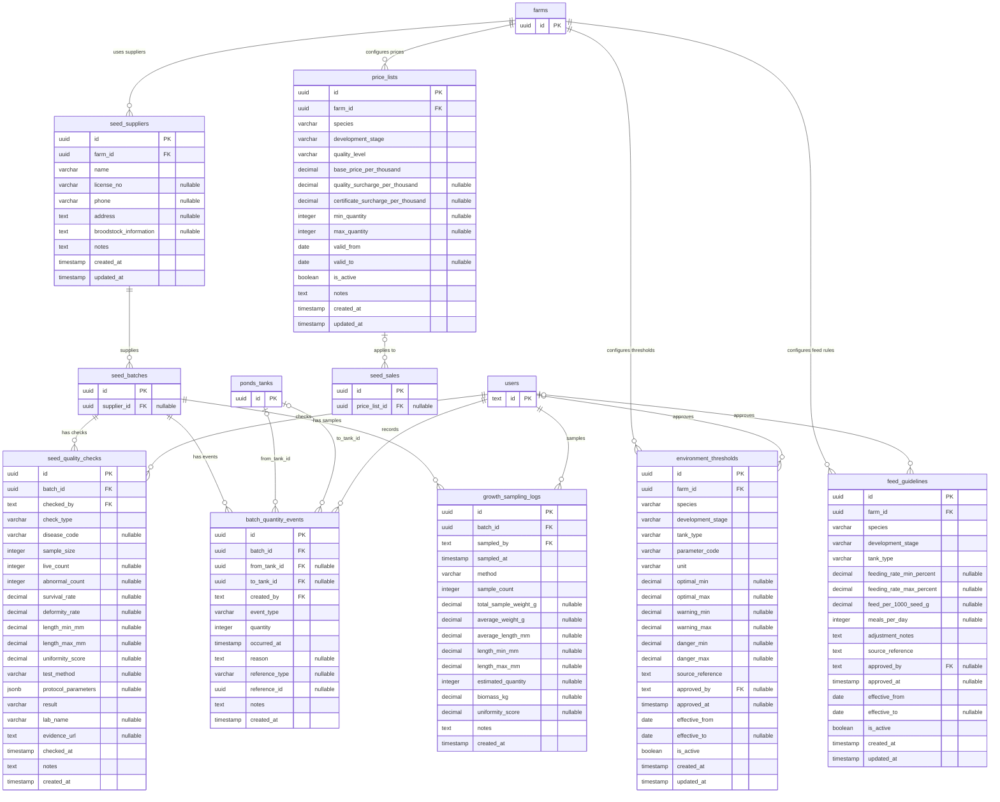

# Sơ đồ cơ sở dữ liệu (ERD)

> Nguồn: [DATABASE.md](./DATABASE.md). Đây là ERD logic theo kiến trúc đích multi-farm: `users` là danh tính dùng chung, còn role/phạm vi được xác định qua `farm_members`. Một người dùng có thể tham gia nhiều `farms`. Migration hiện tại còn một ràng buộc legacy giới hạn non-Owner ở một farm; sơ đồ không mô hình hóa ràng buộc này vì nó trái với kiến trúc đã chốt. Ký hiệu quan hệ dùng chuẩn crow's foot của Mermaid: `||` là đúng 1, `|o` ở đầu bên trái hoặc `o|` ở đầu bên phải là 0 hoặc 1, `o{` là 0..* ở đầu bên phải, `}o` là 0..* ở đầu bên trái.

```mermaid
erDiagram
    users {
        text id PK "Neon Auth user id"
        varchar email UK
        varchar username UK "nullable"
        varchar displayName "nullable"
        varchar phone "nullable"
        timestamp created_at
        timestamp updated_at
    }

    farms {
        uuid id PK
        varchar code UK
        varchar name
        text address "nullable"
        text created_by FK
        timestamp created_at
        timestamp updated_at
    }

    areas {
        uuid id PK
        uuid farm_id FK
        varchar code
        varchar name
        timestamp created_at
        timestamp updated_at
    }

    farm_members {
        uuid farm_id PK, FK
        text user_id PK, FK
        varchar role "owner | area_manager | technician | warehouse_staff"
        varchar status "active | suspended"
        uuid area_id FK "nullable"
        timestamp created_at
    }

    farm_invitations {
        uuid id PK
        uuid farm_id FK
        text invited_user_id FK "nullable"
        text invited_by FK
        varchar email
        varchar role "area_manager | technician | warehouse_staff"
        uuid area_id FK "nullable"
        text token_hash
        varchar status "pending | accepted | cancelled"
        timestamp expires_at
        timestamp accepted_at
        timestamp created_at
    }

    access_sessions {
        uuid id PK
        text user_id FK
        text token_hash UK
        timestamp last_activity
        timestamp expires_at
        timestamp created_at
    }

    password_reset_otp_windows {
        varchar email PK
        timestamp expires_at
        timestamp created_at
        timestamp updated_at
    }

    ponds_tanks {
        uuid id PK
        uuid farm_id FK
        uuid area_id FK "nullable, cần migration"
        varchar code
        varchar name
        varchar tank_type "nursery_tank | pond | other"
        decimal volume_m3
        varchar status "empty | active | cleaning | inactive"
        text description
        timestamp created_at
        timestamp updated_at
    }

    seed_batches {
        uuid id PK
        uuid tank_id FK
        uuid supplier_id FK "nullable"
        varchar batch_code UK
        varchar supplier_lot_code
        varchar species "white_leg_shrimp | black_tiger_shrimp"
        varchar development_stage "PL10 | PL12 | PL15 | PL20 ..."
        varchar broodstock_line "nullable"
        varchar broodstock_status "spf | spr | standard | unknown"
        varchar source
        integer documented_quantity
        integer initial_quantity
        integer current_estimated_quantity
        date production_date "nullable"
        timestamp received_at "nullable"
        integer transport_duration_minutes "nullable"
        text health_certificate_url "nullable"
        date stocked_date
        date expected_sale_date
        varchar status "active | ready_for_sale | sold | failed | cancelled"
        text notes
        timestamp created_at
        timestamp updated_at
    }

    water_parameter_logs {
        uuid id PK
        uuid tank_id FK
        text recorded_by FK
        decimal temperature
        decimal ph
        decimal salinity
        decimal dissolved_oxygen
        decimal nh3
        decimal tan "nullable"
        decimal no2
        decimal nitrate "nullable"
        decimal alkalinity
        decimal h2s "nullable"
        decimal turbidity "nullable"
        decimal water_level_m "nullable"
        varchar measurement_method "manual | iot | lab"
        varchar measurement_device "nullable"
        timestamp recorded_at
        text notes
        timestamp created_at
    }

    feeding_logs {
        uuid id PK
        uuid tank_id FK
        text performed_by FK
        uuid supply_id FK "nullable"
        varchar feed_name
        decimal amount
        varchar unit
        decimal biomass_snapshot_kg "nullable"
        decimal feeding_rate_percent "nullable"
        decimal recommended_amount "nullable"
        varchar feed_check_status "consumed | leftover | not_checked"
        timestamp feeding_time
        text notes
        timestamp created_at
    }

    water_change_logs {
        uuid id PK
        uuid tank_id FK
        text performed_by FK
        decimal water_change_percentage
        timestamp performed_at
        text notes
        timestamp created_at
    }

    treatment_logs {
        uuid id PK
        uuid tank_id FK
        text performed_by FK
        uuid supply_id FK "nullable"
        varchar product_name
        decimal amount
        varchar unit
        text purpose
        timestamp performed_at
        text notes
        timestamp created_at
    }

    ai_inspections {
        uuid id PK
        uuid batch_id FK
        text created_by FK
        text media_url
        text annotated_image_url
        varchar sampling_method "manual | ai | combined"
        decimal sample_volume_ml
        integer manual_count "nullable"
        integer detected_count
        decimal density_per_ml
        decimal correction_factor "nullable"
        decimal average_confidence
        decimal average_size_mm "nullable"
        decimal uniformity_score "nullable"
        jsonb detections
        varchar model_version
        varchar status "pending | processing | completed | failed"
        timestamp inspected_at
        text notes
        timestamp created_at
    }

    inventory_supplies {
        uuid id PK
        uuid farm_id FK
        varchar name
        varchar category "feed | medicine | chemical | probiotic | other"
        varchar unit
        decimal quantity
        decimal unit_price
        decimal min_threshold
        text description
        timestamp created_at
        timestamp updated_at
    }

    inventory_transactions {
        uuid id PK
        uuid supply_id FK
        uuid batch_id FK "nullable"
        text created_by FK
        varchar transaction_type "import | usage | adjustment"
        decimal quantity
        decimal unit_price
        timestamp transaction_date
        text notes
        timestamp created_at
    }

    expense_records {
        uuid id PK
        uuid farm_id FK
        uuid batch_id FK "nullable"
        text created_by FK
        varchar expense_type "seed_purchase | feed | medicine | chemical | electricity | water | labor | transport | other"
        text description
        decimal amount
        varchar allocation_method "days | volume | quantity | biomass | actual_usage"
        date expense_date
        timestamp created_at
    }

    customers {
        uuid id PK
        uuid farm_id FK
        varchar name
        varchar phone
        text address
        varchar customer_type "farm | household | cooperative | other"
        text notes
        timestamp created_at
        timestamp updated_at
    }

    seed_sales {
        uuid id PK
        uuid batch_id FK
        uuid customer_id FK
        text created_by FK
        uuid price_list_id FK "nullable"
        integer quantity_sold
        decimal base_price_per_thousand "nullable"
        decimal quality_surcharge_per_thousand "nullable"
        decimal certificate_surcharge_per_thousand "nullable"
        decimal transport_fee "nullable"
        decimal discount_amount "nullable"
        decimal price_per_thousand
        decimal gross_revenue
        decimal total_revenue
        decimal survival_rate
        date sale_date
        text notes
        timestamp created_at
    }

    alerts_notifications {
        uuid id PK
        uuid farm_id FK
        uuid batch_id FK "nullable"
        uuid tank_id FK "nullable"
        varchar alert_type
        varchar severity "info | warning | critical"
        varchar title
        text message
        boolean is_read
        timestamp created_at
    }

    users ||--o{ farms : "creates"
    farms ||--o{ areas : "contains"
    users ||--o{ farm_members : "has memberships"
    farms ||--o{ farm_members : "has members"
    areas |o--o{ farm_members : "scopes"
    users ||--o{ farm_invitations : "sends"
    users |o--o{ farm_invitations : "receives"
    farms ||--o{ farm_invitations : "has"
    areas |o--o{ farm_invitations : "assigns"
    users ||--o{ access_sessions : "opens"
    farms ||--o{ ponds_tanks : "contains"
    areas |o--o{ ponds_tanks : "contains"
    ponds_tanks ||--o{ seed_batches : "has batches (max 1 current)"

    ponds_tanks ||--o{ water_parameter_logs : "has readings"
    users ||--o{ water_parameter_logs : "records"

    ponds_tanks ||--o{ feeding_logs : "has logs"
    users ||--o{ feeding_logs : "performs"
    inventory_supplies |o--o{ feeding_logs : "may supply"

    ponds_tanks ||--o{ water_change_logs : "has logs"
    users ||--o{ water_change_logs : "performs"

    ponds_tanks ||--o{ treatment_logs : "has logs"
    users ||--o{ treatment_logs : "performs"
    inventory_supplies |o--o{ treatment_logs : "may supply"

    seed_batches ||--o{ ai_inspections : "is inspected"
    users ||--o{ ai_inspections : "creates"

    inventory_supplies ||--o{ inventory_transactions : "has transactions"
    farms ||--o{ inventory_supplies : "owns stock"
    seed_batches |o--o{ inventory_transactions : "may consume"
    users ||--o{ inventory_transactions : "creates"

    seed_batches |o--o{ expense_records : "may incur"
    farms ||--o{ expense_records : "owns expenses"
    users ||--o{ expense_records : "creates"

    seed_batches ||--o{ seed_sales : "is sold through"
    farms ||--o{ customers : "owns customers"
    customers ||--o{ seed_sales : "makes purchases"
    users ||--o{ seed_sales : "creates"

    seed_batches |o--o{ alerts_notifications : "may trigger"
    ponds_tanks |o--o{ alerts_notifications : "may trigger"
    farms ||--o{ alerts_notifications : "has alerts"
```

## ERD mở rộng nghiệp vụ

Các bảng dưới đây bổ sung khả năng hiện thực hóa quy chuẩn chất lượng, truy xuất biến động số lượng, lấy mẫu tăng trưởng, ngưỡng môi trường, định mức thức ăn và bảng giá. Chúng cần được tạo migration khi các chức năng tương ứng được đưa vào codebase.

## Ghi chú đọc sơ đồ

- `UK` = `UNIQUE KEY` (`users.email`, `seed_batches.batch_code`).
- Trong quan hệ `PARENT |o--o{ CHILD`, đầu `|o` cho biết mỗi `CHILD` tham chiếu `0..1` `PARENT`; đầu `o{` cho biết một `PARENT` có thể liên quan `0..*` `CHILD`.
- Quan hệ vẽ bằng `|o--o{` (thay vì `||--o{`) là các khóa ngoại **nullable** theo đúng chú thích trong DATABASE.md: `feeding_logs.supply_id`, `treatment_logs.supply_id`, `inventory_transactions.batch_id`, `expense_records.batch_id`, `alerts_notifications.batch_id`, `alerts_notifications.tank_id`. `expense_records.batch_id` nullable vì chi phí vận hành chung (`electricity`, `water`, `labor`) không thuộc riêng một lô nào.
- Một `users` có thể tạo nhiều `farms` và tham gia nhiều `farms`. Quan hệ phân quyền không nằm ở `users` mà nằm tại `farm_members`, với khóa chính ghép `(farm_id, user_id)`.
- `farms.created_by` chỉ là người tạo bản ghi. Owner của từng farm được xác định bởi `farm_members.role = 'owner'` và `status = 'active'`.
- `farm_invitations.area_id` là khóa ngoại nullable tới `areas.id`; `ponds_tanks.area_id` cần migration để hoàn thiện phân quyền theo khu vực.
- `ai_inspections.detections` là `JSONB` chứa mảng bounding box (`class`, `confidence`, `bbox`) nên không tách thành bảng `ai_detections` riêng — đúng theo lý do đã nêu trong DATABASE.md.
- Quan hệ `ponds_tanks`–`seed_batches` là 1-N theo lịch sử: một ao/bể có thể được tái sử dụng cho nhiều lô ở các chu kỳ khác nhau, nhưng chỉ có tối đa một lô ở trạng thái `active` hoặc `ready_for_sale` tại một thời điểm. Ràng buộc này cần được kiểm tra ở Backend và/hoặc partial unique index.
- `water_parameter_logs` là dữ liệu cấp ao/bể nên chỉ liên kết với `ponds_tanks` và `users`. Không vẽ quan hệ trực tiếp với `seed_batches`; giống/lô hiện tại được xác định qua quan hệ ao/bể và quy tắc thời điểm.
- `feeding_logs`, `water_change_logs` và `treatment_logs` cũng là nhật ký cấp ao/bể nên chỉ liên kết với `ponds_tanks` và `users`, cùng quy tắc với `water_parameter_logs` — cả 4 bảng nhật ký chăm sóc đều neo theo `tank_id`, không lưu `batch_id`, để tránh dữ liệu mâu thuẫn và vẫn ghi được hoạt động khi ao/bể đang `empty`/`cleaning` (chưa có lô nào chiếm dụng). Riêng `ai_inspections` liên kết trực tiếp với `seed_batches` vì kiểm tra AI luôn gắn với một lô cụ thể đang có mẫu để lấy; ao/bể lấy mẫu được suy ra qua `seed_batches.tank_id`.
- `farm_members.role` và `farm_invitations.role` dùng cùng một tập giá trị. `sales_staff` và `viewer` nằm ngoài phạm vi hiện tại.
- `access_sessions` lưu phiên truy cập riêng của ứng dụng; Neon Auth vẫn là nơi xác thực danh tính và mật khẩu.
- Các ngưỡng trong `environment_thresholds` và định mức trong `feed_guidelines` phải có nguồn, ngày hiệu lực và trạng thái phê duyệt; không coi các giá trị tham khảo là ràng buộc cứng cho mọi trại.

## Đối chiếu khóa ngoại

| Bảng con | Khóa ngoại | Bảng cha | Bắt buộc trên bản ghi con | Bội số từ bảng cha |
|---|---|---|---|---|
| `farms` | `created_by` | `users` | Đúng 1 người tạo | `0..*` farm/user |
| `farm_members` | `farm_id`, `user_id` | `farms`, `users` | Đúng 1 farm và 1 user | N-N qua bảng thành viên |
| `farm_members` | `area_id` | `areas` | `0..1` khu vực | `0..*` thành viên/khu vực |
| `farm_invitations` | `farm_id`, `invited_by` | `farms`, `users` | Đúng 1 farm và 1 người gửi | `0..*` lời mời/cha |
| `farm_invitations` | `invited_user_id` | `users` | `0..1` người nhận | `0..*` lời mời/user |
| `farm_invitations` | `area_id` | `areas` | `0..1` khu vực | `0..*` lời mời/khu vực |
| `access_sessions` | `user_id` | `users` | Đúng 1 user | `0..*` phiên/user |
| `inventory_supplies` | `farm_id` | `farms` | Đúng 1 farm | `0..*` vật tư/farm |
| `ponds_tanks` | `farm_id` | `farms` | Đúng 1 farm | `0..*` ao/bể/farm |
| `ponds_tanks` | `area_id` | `areas` | `0..1` khu vực | `0..*` ao/bể/khu vực |
| `seed_batches` | `tank_id` | `ponds_tanks` | Đúng 1 ao/bể | `0..*` lô/ao/bể |
| `water_parameter_logs` | `tank_id`, `recorded_by` | `ponds_tanks`, `users` | Đúng 1 bản ghi cha cho mỗi FK | `0..*` log/bản ghi cha |
| `feeding_logs` | `tank_id`, `performed_by` | `ponds_tanks`, `users` | Đúng 1 bản ghi cha cho mỗi FK | `0..*` log/bản ghi cha |
| `feeding_logs` | `supply_id` | `inventory_supplies` | `0..1` vật tư | `0..*` log/vật tư |
| `water_change_logs` | `tank_id`, `performed_by` | `ponds_tanks`, `users` | Đúng 1 bản ghi cha cho mỗi FK | `0..*` log/bản ghi cha |
| `treatment_logs` | `tank_id`, `performed_by` | `ponds_tanks`, `users` | Đúng 1 bản ghi cha cho mỗi FK | `0..*` log/bản ghi cha |
| `treatment_logs` | `supply_id` | `inventory_supplies` | `0..1` vật tư | `0..*` log/vật tư |
| `ai_inspections` | `batch_id`, `created_by` | `seed_batches`, `users` | Đúng 1 bản ghi cha cho mỗi FK | `0..*` inspection/bản ghi cha |
| `inventory_transactions` | `supply_id` | `inventory_supplies` | Đúng 1 vật tư | `0..*` giao dịch/vật tư |
| `inventory_transactions` | `batch_id` | `seed_batches` | `0..1` lô giống | `0..*` giao dịch/lô |
| `inventory_transactions` | `created_by` | `users` | Đúng 1 user | `0..*` giao dịch/user |
| `expense_records` | `farm_id` | `farms` | Đúng 1 farm | `0..*` chi phí/farm |
| `expense_records` | `batch_id` | `seed_batches` | `0..1` lô — nullable, chi phí chung của trại khi `NULL` | `0..*` chi phí/lô |
| `expense_records` | `created_by` | `users` | Đúng 1 user | `0..*` chi phí/user |
| `customers` | `farm_id` | `farms` | Đúng 1 farm | `0..*` khách hàng/farm |
| `seed_sales` | `batch_id`, `customer_id`, `created_by` | `seed_batches`, `customers`, `users` | Đúng 1 bản ghi cha cho mỗi FK | `0..*` giao dịch/bản ghi cha |
| `alerts_notifications` | `farm_id` | `farms` | Đúng 1 farm | `0..*` cảnh báo/farm |
| `alerts_notifications` | `batch_id` | `seed_batches` | `0..1` lô giống | `0..*` cảnh báo/lô |
| `alerts_notifications` | `tank_id` | `ponds_tanks` | `0..1` ao/bể | `0..*` cảnh báo/ao/bể |

`password_reset_otp_windows` không có FK tới `users`; đây là cửa sổ giới hạn theo email phục vụ luồng đặt lại mật khẩu. Các cột FK trỏ tới `users` dùng kiểu `TEXT` vì ID người dùng do Neon Auth cấp.

Các bảng nghiệp vụ có `farm_id` phải được kiểm tra thêm để `farm_id` của bản ghi cha liên quan cũng trùng với farm đang thao tác. Đây là ràng buộc chống truy cập chéo tenant cần thực hiện ở service/repository; về sau có thể tăng cường bằng khóa ngoại ghép hoặc constraint phù hợp.

### Khóa ngoại của phần mở rộng

| Bảng con | Khóa ngoại | Bảng cha | Bắt buộc trên bản ghi con |
|---|---|---|---|
| `seed_batches` | `supplier_id` | `seed_suppliers` | `0..1` nhà cung cấp |
| `seed_suppliers` | `farm_id` | `farms` | Đúng 1 farm |
| `seed_quality_checks` | `batch_id`, `checked_by` | `seed_batches`, `users` | Bắt buộc |
| `batch_quantity_events` | `batch_id`, `created_by` | `seed_batches`, `users` | Bắt buộc |
| `batch_quantity_events` | `from_tank_id`, `to_tank_id` | `ponds_tanks` | Nullable; dùng theo loại sự kiện |
| `growth_sampling_logs` | `batch_id`, `sampled_by` | `seed_batches`, `users` | Bắt buộc |
| `seed_sales` | `price_list_id` | `price_lists` | `0..1` bảng giá; giao dịch vẫn lưu đơn giá snapshot |
| `environment_thresholds` | `approved_by` | `users` | `0..1` người phê duyệt |
| `feed_guidelines` | `approved_by` | `users` | `0..1` người phê duyệt |
| `environment_thresholds` | `farm_id` | `farms` | Đúng 1 farm |
| `feed_guidelines` | `farm_id` | `farms` | Đúng 1 farm |
| `price_lists` | `farm_id` | `farms` | Đúng 1 farm |

`environment_thresholds` và `feed_guidelines` là bảng cấu hình độc lập, không chứa khóa ngoại tới lô hoặc ao/bể vì chúng được áp dụng theo loài, giai đoạn và loại hệ thống.

## Tổng hợp theo nhóm nghiệp vụ

| Nhóm | Bảng |
| --- | --- |
| Người dùng & trang trại | `users`, `farms`, `areas`, `farm_members`, `farm_invitations` |
| Sản xuất | `ponds_tanks`, `seed_batches` |
| Nhật ký chăm sóc | `water_parameter_logs`, `feeding_logs`, `water_change_logs`, `treatment_logs` |
| AI | `ai_inspections` |
| Kho | `inventory_supplies`, `inventory_transactions` |
| Tài chính & khách hàng | `expense_records`, `customers`, `seed_sales` |
| Cảnh báo | `alerts_notifications` |
| Quy chuẩn & cấu hình | `seed_suppliers`, `seed_quality_checks`, `environment_thresholds`, `feed_guidelines`, `price_lists` |
| Truy xuất sản xuất | `batch_quantity_events`, `growth_sampling_logs` |
