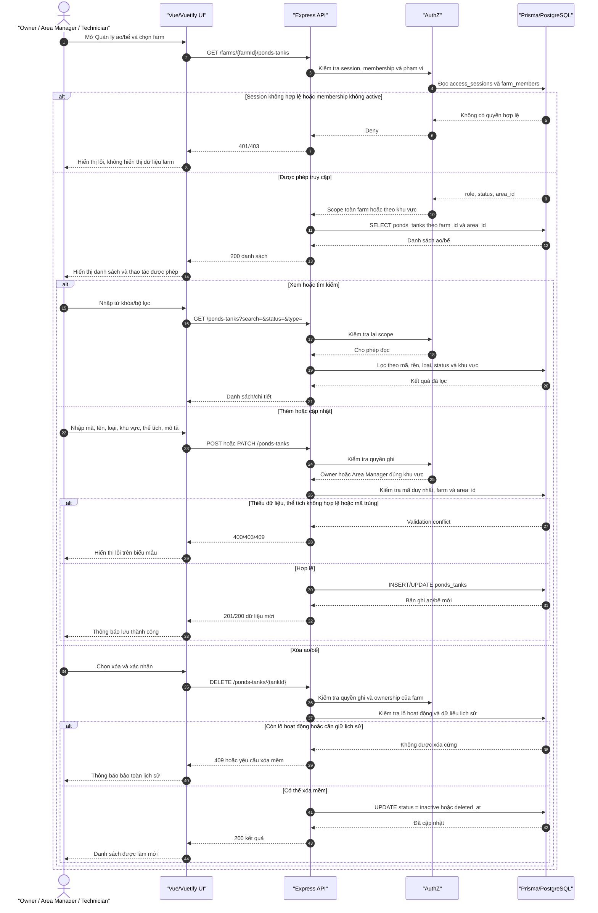
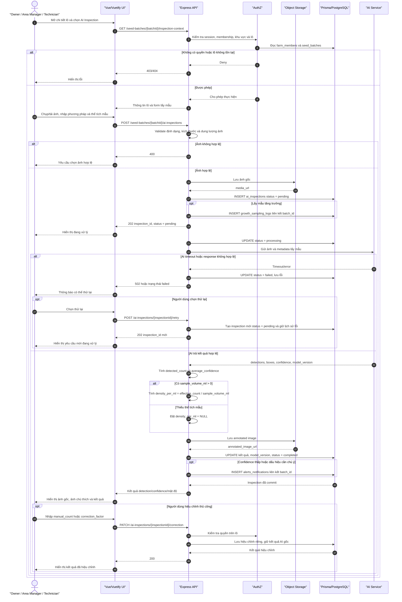
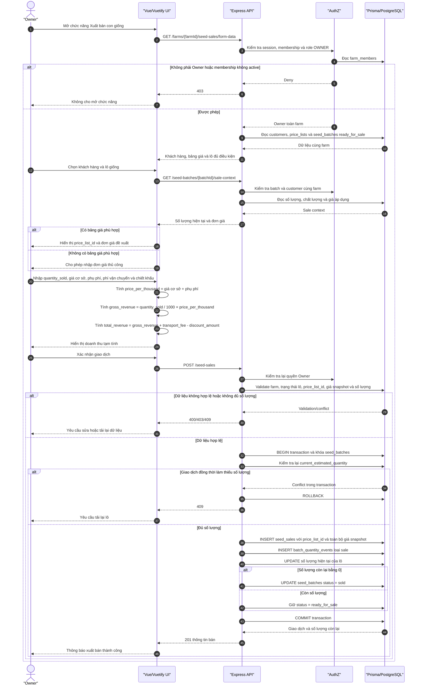
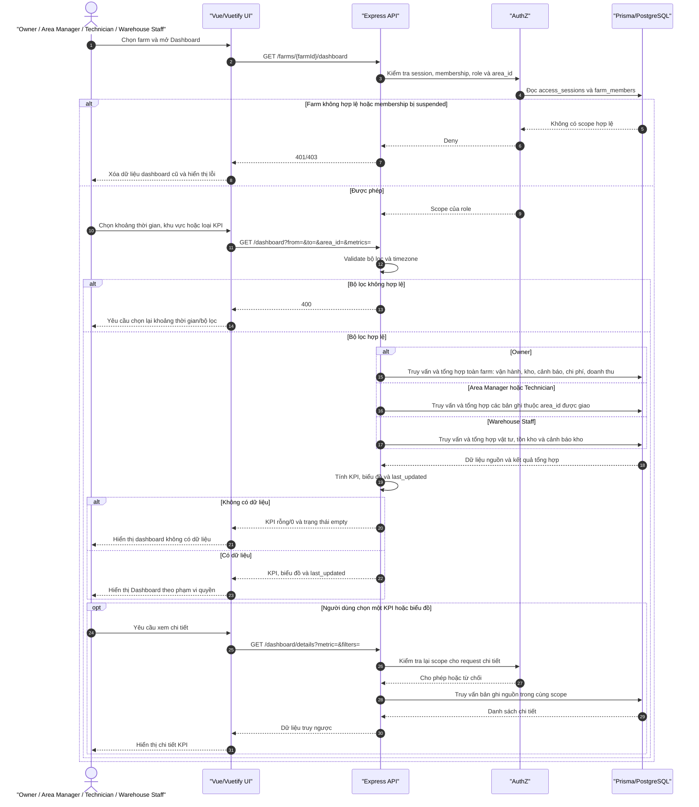

# Sơ đồ Sequence cho 5 use case cấp 2 trọng tâm — ChillShrimp

> Nguồn đặc tả: [USECASE-SPECIFICATION.md](./USECASE-SPECIFICATION.md#7-đặc-tả-chi-tiết-5-use-case-trọng-tâm). Tên endpoint trong các sơ đồ mang tính định hướng; khi hiện thực phải tuân theo router và convention API chính thức của dự án.

> Mỗi khối Mermaid là một sơ đồ Sequence độc lập; khi nhập vào draw.io/VPasCode, chỉ sao chép phần mã bên trong từng khối Mermaid.

Các sơ đồ được tách theo đúng năm mã use case:

1. UC04.2 — CRUD ao hoặc bể
2. UC05.1 — CRUD lô giống
3. UC06.1 — Thực hiện AI Inspection
4. UC08.5 — Xuất bán con giống
5. UC09.1 — Xem Dashboard theo phạm vi quyền

## Thành phần dùng chung

- **Vue/Vuetify UI**: hiển thị form, danh sách, dashboard và validation cơ bản phía client.
- **Express API**: tiếp nhận request, validation nghiệp vụ, điều phối transaction và trả response.
- **AuthZ**: kiểm tra phiên, membership, role, status và area_id tại farm đang chọn.
- **Prisma/PostgreSQL**: truy vấn, khóa bản ghi và bảo đảm tính nguyên tử dữ liệu.
- **Object Storage**: lưu ảnh gốc và ảnh chú thích của AI Inspection.
- **AI Service**: phân tích ảnh, trả detection, bounding box, confidence và model version.

> **Bố cục mô phỏng mẫu báo cáo:** actor ở bên trái, tiếp theo là giao diện, API, AuthZ, cơ sở dữ liệu và dịch vụ phụ trợ. Mũi tên đi từ trên xuống dưới; các nhánh alt thể hiện điều kiện thành công, lỗi và xử lý thay thế.

---

## 1. UC04.2 — CRUD ao hoặc bể



**Kết quả:** dữ liệu ao/bể chỉ được tạo, đọc, cập nhật hoặc xóa mềm trong đúng farm và phạm vi khu vực. Việc chuyển trạng thái vận hành của ao/bể là UC04.3.

---

## 2. UC05.1 — CRUD lô giống

```mermaid
sequenceDiagram
    autonumber
    actor U as "Owner / Area Manager / Technician"
    participant FE as "Vue/Vuetify UI"
    participant API as "Express API"
    participant AUTH as "AuthZ"
    participant DB as "Prisma/PostgreSQL"

    U->>FE: Chọn farm, ao/bể và mở Quản lý lô giống
    FE->>API: GET /farms/{farmId}/seed-batches
    API->>AUTH: Kiểm tra session, membership, role và area_id
    AUTH->>DB: Đọc access_sessions, farm_members và areas

    alt Không có quyền hoặc ngoài khu vực
        DB-->>AUTH: Scope không hợp lệ
        AUTH-->>API: Deny
        API-->>FE: 401/403
        FE-->>U: Hiển thị lỗi
    else Được phép
        AUTH-->>API: Scope hợp lệ
        API->>DB: Đọc seed_batches theo farm, tank và status
        DB-->>API: Danh sách lô
        API-->>FE: Danh sách lô giống

        alt Xem chi tiết
            U->>FE: Chọn một lô
            FE->>API: GET /seed-batches/{batchId}
            API->>AUTH: Kiểm tra lại phạm vi lô
            API->>DB: Đọc seed_batches, quality checks, quantity events và samples
            DB-->>API: Hồ sơ và lịch sử lô
            API-->>FE: Chi tiết lô
        else Tạo lô mới
            U->>FE: Nhập mã lô, loài, PL, nhà cung cấp, số lượng và ngày nhận
            FE->>API: POST /seed-batches
            API->>AUTH: Kiểm tra quyền tạo
            AUTH-->>API: Owner hoặc Area Manager, Technician theo quyền được cấp
            API->>DB: Transaction khóa ao/bể và kiểm tra trạng thái
            API->>DB: Kiểm tra ao/bể cùng farm chưa có lô active
            alt Ao/bể không sẵn sàng hoặc mã lô trùng
                DB-->>API: Conflict
                API-->>FE: 400/409
                FE-->>U: Yêu cầu chọn ao/bể hoặc mã khác
            else Dữ liệu hợp lệ
                API->>DB: INSERT seed_batches
                API->>DB: INSERT batch_quantity_events loại initial
                opt Có hồ sơ kiểm dịch/chất lượng
                    API->>DB: INSERT seed_quality_checks
                end
                API->>DB: Commit transaction
                DB-->>API: Lô và số lượng ban đầu
                API-->>FE: 201 lô giống
                FE-->>U: Thông báo tạo thành công
            end
        else Cập nhật lô
            U->>FE: Sửa các trường được phép
            FE->>API: PATCH /seed-batches/{batchId}
            API->>AUTH: Kiểm tra role, farm và area_id
            AUTH-->>API: Cho phép hoặc từ chối trường dữ liệu
            API->>DB: Kiểm tra lô chưa kết thúc và validate dữ liệu
            alt Lô đã sold/failed/cancelled hoặc actor ngoài phạm vi
                DB-->>API: Không thể cập nhật
                API-->>FE: 403/409
                FE-->>U: Hiển thị lý do
            else Hợp lệ
                API->>DB: UPDATE các trường được phép
                DB-->>API: Hồ sơ lô mới
                API-->>FE: 200 dữ liệu cập nhật
                FE-->>U: Làm mới chi tiết lô
            end
        else Yêu cầu xóa lô
            U->>FE: Yêu cầu xóa lô đã có lịch sử
            FE->>API: DELETE /seed-batches/{batchId}
            API->>AUTH: Kiểm tra quyền và phạm vi lô
            AUTH-->>API: Cho phép kiểm tra lịch sử
            API->>DB: Kiểm tra lịch sử số lượng, chất lượng, mẫu và giao dịch
            DB-->>API: Quan hệ cần bảo toàn
            API->>DB: Không xóa cứng; chuyển UC05.2 hoặc lưu dấu vết hủy
            DB-->>API: Trạng thái xử lý mới
            API-->>FE: 200/409 kết quả xử lý
            FE-->>U: Thông báo không xóa cứng dữ liệu lịch sử
        end
    end
```

**Kết quả:** lô mới và sự kiện số lượng ban đầu được ghi nguyên tử; các thay đổi sau đó không ghi đè lịch sử. Yêu cầu xóa được xử lý theo hướng bảo toàn dữ liệu và chuyển trạng thái qua UC05.2. Nhật ký chăm sóc thuộc UC05.3–UC05.6.

---

## 3. UC06.1 — Thực hiện AI Inspection



**Kết quả:** bản ghi ai_inspections luôn có trạng thái rõ ràng pending, processing, completed hoặc failed. AI chỉ hỗ trợ đếm/đánh giá mẫu; không tự chẩn đoán bệnh hay thay thế đánh giá chuyên môn.

---

## 4. UC08.5 — Xuất bán con giống



**Kết quả:** giao dịch bán, sự kiện giảm số lượng và trạng thái lô được ghi trong cùng transaction, tránh bán vượt tồn lượng khi có nhiều request đồng thời.

---

## 5. UC09.1 — Xem Dashboard theo phạm vi quyền



**Kết quả:** dashboard không làm thay đổi dữ liệu nghiệp vụ và không thể hiển thị dữ liệu chéo farm. Mỗi request, kể cả request xem chi tiết KPI, đều phải kiểm tra lại phạm vi quyền.

---

## Phạm vi không đưa vào 5 sơ đồ này

- UC04.1, UC04.3: thông tin farm và trạng thái ao/bể.
- UC05.2–UC05.6: trạng thái lô, môi trường nước, cho ăn, thay nước và thuốc/chế phẩm.
- UC06.2: xem lịch sử AI Inspection.
- UC08.1–UC08.4, UC08.6: chi phí, khách hàng và doanh thu.
- UC09.2–UC09.4: cảnh báo toàn trại, theo khu vực và cảnh báo tồn kho.

Việc tách phạm vi giúp mỗi Sequence Diagram có một mục tiêu nghiệp vụ rõ ràng, ánh xạ được tới actor, API, AuthZ, Prisma/Database và dịch vụ phụ trợ tương ứng.
