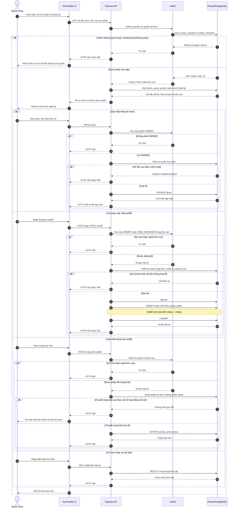
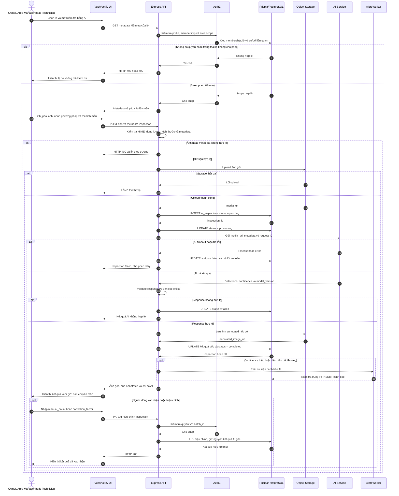
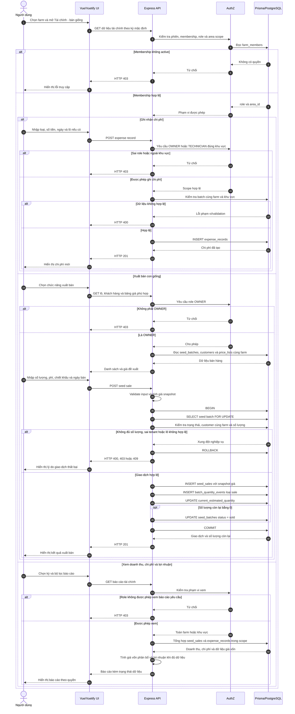
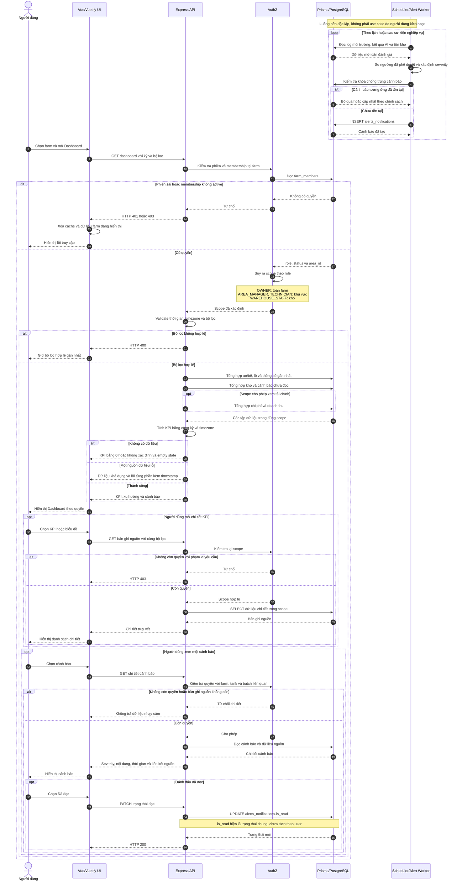

# Sơ đồ Sequence cho 5 use case trọng tâm — ChillShrimp

> Nguồn đặc tả: [USECASE-SPECIFICATION.md](./USECASE-SPECIFICATION.md#7-đặc-tả-chuyên-sâu-5-use-case-trọng-tâm). Tên endpoint trong sơ đồ mang tính định hướng; khi hiện thực phải tuân theo router và convention API chính thức của dự án.

## Thành phần dùng chung

- **Vue/Vuetify UI**: giao diện web và validation cơ bản phía client.
- **Express API**: điều phối use case, validation nghiệp vụ và transaction.
- **AuthZ**: kiểm tra phiên, `farm_members.status`, role và `area_id` tại farm đang chọn.
- **Prisma/PostgreSQL**: truy vấn và bảo đảm tính nguyên tử dữ liệu.
- **Storage/AI Service/Alert Worker**: thành phần chuyên biệt chỉ xuất hiện khi use case cần.

---

## 1. UC04 — Quản lý trang trại

---

## 2. UC05 — Quản lý lô giống và chăm sóc

```mermaid
sequenceDiagram
    autonumber
    actor U as Owner, Area Manager hoặc Technician
    participant FE as Vue/Vuetify UI
    participant API as Express API
    participant AUTH as AuthZ
    participant DB as Prisma/PostgreSQL
    participant JOB as Alert Worker

    U->>FE: Chọn farm, khu vực và ao/bể
    FE->>API: GET ao/bể và lô hiện tại
    API->>AUTH: Kiểm tra phiên, membership và area scope
    AUTH->>DB: Đọc farm_members

    alt Không có quyền hợp lệ
        DB-->>AUTH: Membership thiếu, suspended hoặc sai khu vực
        AUTH-->>API: Từ chối
        API-->>FE: HTTP 403
        FE-->>U: Hiển thị lỗi truy cập
    else Có quyền
        DB-->>AUTH: role và area_id hợp lệ
        AUTH-->>API: Cho phép trong scope
        API->>DB: Đọc ponds_tanks và seed_batches hiện tại
        DB-->>API: Trạng thái ao/bể và lô
        API-->>FE: Dữ liệu vận hành

        opt Tạo lô giống mới
            U->>FE: Nhập nguồn giống, mã lô, PL, số lượng và ngày
            FE->>API: POST seed batch
            API->>AUTH: Kiểm tra quyền tạo lô
            alt Không phải OWNER/AREA_MANAGER hoặc ngoài khu vực
                AUTH-->>API: Từ chối
                API-->>FE: HTTP 403
            else Được phép tạo lô
                AUTH-->>API: Scope hợp lệ
                API->>DB: BEGIN và khóa ao/bể
                API->>DB: Kiểm tra ao/bể empty và không có lô chiếm dụng
                alt Ao/bể không sẵn sàng hoặc dữ liệu lô sai
                    DB-->>API: Vi phạm trạng thái, unique hoặc validation
                    API->>DB: ROLLBACK
                    API-->>FE: HTTP 400 hoặc 409
                else Dữ liệu hợp lệ
                    API->>DB: INSERT seed_batches
                    API->>DB: INSERT batch_quantity_events loại stocking
                    API->>DB: UPDATE ponds_tanks status = active
                    API->>DB: COMMIT
                    DB-->>API: Lô active đã tạo
                    API-->>FE: HTTP 201 và hồ sơ lô
                end
            end
        end

        loop Khi có lô active, mỗi lần ghi nhận chăm sóc
            U->>FE: Chọn môi trường, cho ăn, thay nước hoặc xử lý
            FE->>API: GET cấu hình và vật tư áp dụng
            API->>DB: Đọc lô, ngưỡng, định mức và tồn kho trong scope
            DB-->>API: Dữ liệu tham chiếu
            API-->>FE: Form và dữ liệu gợi ý
            U->>FE: Nhập số liệu thực tế và xác nhận
            FE->>API: POST nhật ký tương ứng
            API->>AUTH: Kiểm tra quyền theo farm và khu vực
            alt Sai role hoặc ngoài khu vực
                AUTH-->>API: Từ chối
                API-->>FE: HTTP 403
            else Được phép ghi nhật ký
                AUTH-->>API: Scope hợp lệ
                API->>API: Validate miền giá trị, đơn vị và thời gian

                alt Dữ liệu không hợp lệ
                    API-->>FE: HTTP 400 và lỗi theo trường
                else Có liên kết supply_id
                    API->>DB: BEGIN và khóa inventory_supplies
                    API->>DB: Kiểm tra số lượng tồn
                    alt Tồn kho không đủ
                        DB-->>API: Không đủ tồn
                        API->>DB: ROLLBACK
                        API-->>FE: HTTP 409
                    else Tồn kho đủ
                        API->>DB: INSERT nhật ký theo tank_id
                        API->>DB: INSERT inventory_transactions loại usage
                        API->>DB: UPDATE số lượng tồn
                        API->>DB: COMMIT
                        API-->>FE: HTTP 201
                    end
                else Không liên kết kho
                    API->>DB: INSERT nhật ký theo tank_id
                    DB-->>API: Nhật ký đã lưu
                    API-->>FE: HTTP 201
                end

                opt Nhật ký đã lưu và thông số vượt ngưỡng đã phê duyệt
                    API-->>JOB: Phát sự kiện cần tạo cảnh báo
                    JOB->>DB: Kiểm tra trùng và INSERT alerts_notifications
                end
            end
        end

        opt Lấy mẫu hoặc cập nhật biến động số lượng
            U->>FE: Nhập dữ liệu mẫu hoặc sự kiện số lượng
            FE->>API: POST growth sample hoặc quantity event
            API->>DB: BEGIN và khóa seed_batches
            API->>API: Tính số lượng mới, tỷ lệ sống, mật độ và sinh khối
            alt Dữ liệu sai hoặc số lượng mới âm
                API->>DB: ROLLBACK
                API-->>FE: HTTP 400 hoặc 409
            else Hợp lệ
                API->>DB: INSERT sự kiện hoặc mẫu tăng trưởng
                API->>DB: UPDATE current_estimated_quantity khi cần
                API->>DB: COMMIT
                API-->>FE: Chỉ số mới của lô
            end
        end

        opt Cập nhật trạng thái lô
            U->>FE: Chọn trạng thái mới
            FE->>API: PATCH seed batch status
            API->>AUTH: Kiểm tra role được phép
            AUTH-->>API: Kết quả
            API->>DB: Kiểm tra state transition
            alt Không hợp lệ
                API-->>FE: HTTP 403 hoặc 409
            else Hợp lệ
                API->>DB: UPDATE seed_batches và đồng bộ ponds_tanks
                DB-->>API: Hồ sơ lô mới
                API-->>FE: HTTP 200
            end
        end

        FE-->>U: Hiển thị hồ sơ và lịch sử chăm sóc đã cập nhật
    end
```

---

## 3. UC06 — Kiểm tra và phân tích AI

---

## 4. UC08 — Quản lý tài chính và bán giống

---

## 5. UC09 — Quản lý thống kê và cảnh báo

